# ▪ Masternode Multinode easy to deploy

## Required

* **Masternode collateral**\
  Valid collateral amount related to the current block as well as each blockchain specification.\
  \
  Please review the information presented on this website in the [<mark style="color:blue;">**Coins**</mark>](../../coins/) section. Within each coin information, the collateral values are listed below on the **Rewards Breakdown** Board\

* **Local Wallet**\
  An installed wallet is required to handle the collateral. It can be downloaded directly from the GitHub coin repository.\
  \
  Please review the information presented in this docs in the [<mark style="color:blue;">**Coins**</mark>](../../coins/) section. Within each coin information, a **Wallet Download** link for that Github is provided.\

* **VPS with UBUNTU 22.04** ([**preferable**](https://contabo.com/en/vps/?utm\_source=cj\&utm\_medium=affiliate\&utm\_campaign=vps\&source=affiliate\&AID=12454592\&PID=6839992))\
  A Virtual Private Server is required to keep the masternodes up and running with continuous and stable connections. \
  It should be running the UBUNTU v22.04 Linux distribution installed. \
  [**Learn how to set up a VPS** ](setting-up-a-virtual-private-server-vps.md)\

* **Terminal emulator**\
  Tool needed to connect to the above VPS. The most commonly used one is **Putty.** [<mark style="color:blue;">**Learn how to use PuTTY**</mark> ](using-a-terminal-emulator-putty.md)\
  **O**ther more modern options such as  **Tabby** [**https://github.com/Eugeny/tabby**](https://github.com/Eugeny/tabby) are also good and viable. \

* **DECENOMY Masternode Multinode**\
  To easily install and manage your masternodes multinode. \
  For more detailed information about this tool please see the information presented on this website in the [**DECENOMY Multinode Script**](../decenomy-multinode-script/) section. We highly recommend [**Contabo VPS**](https://contabo.com/en/vps/?source=affiliate\&AID=12454592\&PID=6839992) as they have proven to be a reliable and consistent provider.\

### <mark style="color:green;">Step 1 - Terminal Emulator ( VPS )</mark>

\
To get started, we need to install the [<mark style="color:blue;">**DECENOMY Multinode Script**</mark>](../decenomy-multinode-script/) on the purchased VPS.\
\
To install and run the script for the first time, you should copy and paste the following command into your terminal emulator after connecting to your VPS, with root privileges:&#x20;

**`wget -q https://raw.githubusercontent.com/decenomy/mnscript/main/decenomy.sh && bash decenomy.sh`**

_Note:_\
_After the first run, the script will convert the file " decenomy.sh " into an executable file named decenomy. Therefore, the user can simply type the following command at the terminal prompt to run the script the next time:_\
\
_**./decenomy**_\
\
Your terminal emulator will display a screen like the one shown below:

<figure>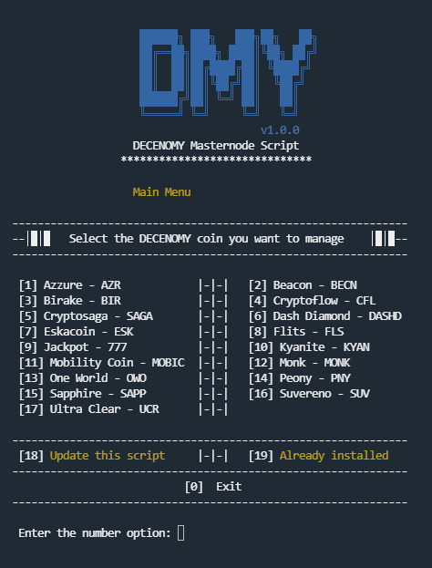<figcaption></figcaption></figure>

Enter the number of the coin you want to install the masternode on and follow the script instructions. ( if you need help on the script side, please follow this chapter at Multinode script - [<mark style="color:blue;">**link**</mark>](../decenomy-multinode-script/coin-selection/) )\
\
At the end, you will get a screen like this:

<figure>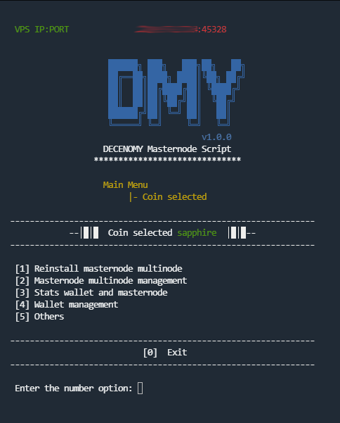<figcaption></figcaption></figure>

Leave the terminal emulator in this state so that you have access to the VPS IP shown above, which will be used in the next step for the Local Wallet.

### <mark style="color:green;">Step 2 - Local Wallet</mark>

To install the local wallet of the desired coin, please visit the [<mark style="color:blue;">**Coins**</mark>](../../coins/) section. Within each coin's information, a **Wallet Download** link from its respective Github repository is provided.\
\
Make sure you have enough funds in your wallet to process the collateral creation, and follow the steps shown in the following screen:

<figure>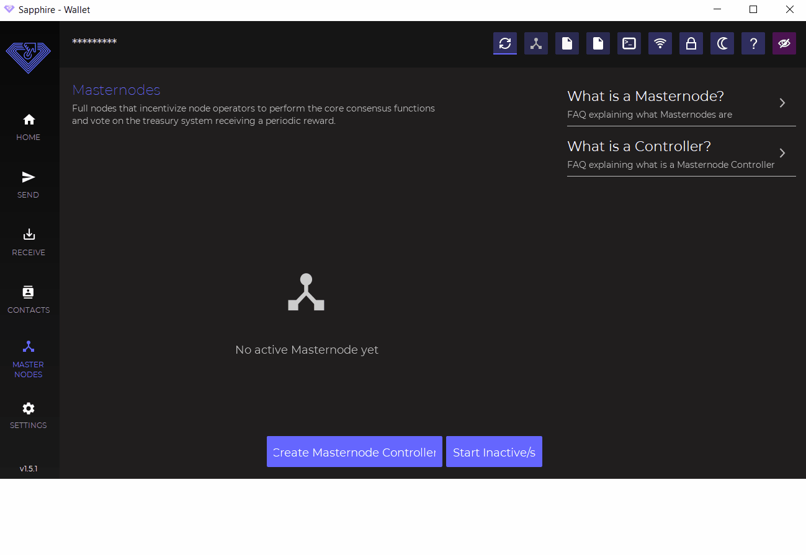<figcaption></figcaption></figure>

Once the collateral is created, please open the _**masternode.conf**_ file by selecting the icon in the upper right corner and using your preferred text editor.

<figure>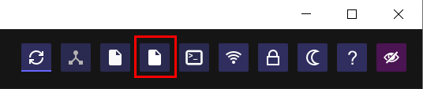<figcaption></figcaption></figure>

The contents of the file will always be organized in the same order.

**Example:** \
<mark style="color:orange;">mn1</mark> <mark style="color:blue;">127.0.0.2:45328</mark> <mark style="color:red;">P3HaYBVUCYjEMeeH1Y4sBGLALQZE1Yc1K64xiqgX37tGBDQL8Xg</mark> <mark style="color:green;">2bcd3c84c84f87eaa86e4e56834c92927a07f9e18718810b92e0d0324456a67c</mark> <mark style="color:purple;">0</mark>

**Format:** \
<mark style="color:orange;">alias</mark> <mark style="color:blue;">IP:port</mark> <mark style="color:red;">masternodeprivkey</mark> <mark style="color:green;">collateral\_output\_txid</mark> <mark style="color:purple;">collateral\_output\_index</mark>

<figure>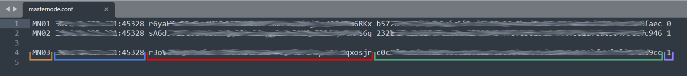<figcaption></figcaption></figure>

For the next step, we will need the masternodeprivkey information, which is different and unique for each masternode collateral created.\
In this example, we will have three masternodeprivkeys for each of the three masternode collaterals created.

### <mark style="color:green;">Step 3 - Adding masternodeprivkey to Multinode</mark>

On your terminal emulator, follow the steps illustrated below to add the masternodeprivkey and create your masternode multinode. If you need more help with the script, please refer to this chapter on the **Multinode script** - [<mark style="color:blue;">**link**</mark>](../decenomy-multinode-script/coin-selection/masternode-multinode-management.md) )

<figure>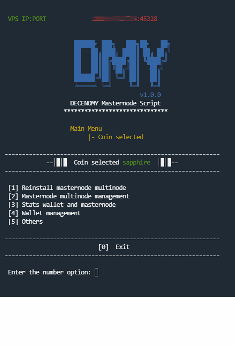<figcaption></figcaption></figure>

At this point, we should already have:\
\
\- A local wallet with sufficient funds that has created the necessary collateral.\
\
\- A running wallet on our VPS with the masternodeprivkey entered in the multinode list. This information comes from the local wallet.\
\
On the terminal emulator, on the script side, follow the instructions:\
**Coin Selected** - **Wallet and masternode stats** - **Masternode Statistics** \
We should be able to see the following information, indicating that three masternodes have been created, but are still disabled:

<figure>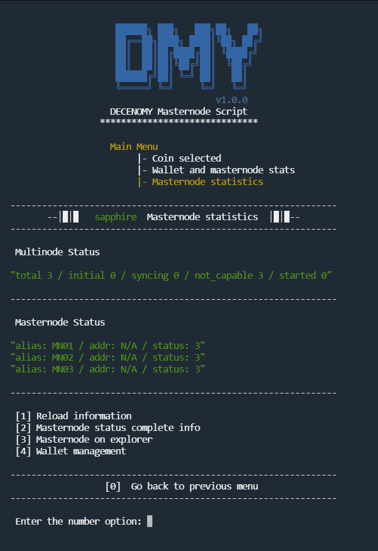<figcaption></figcaption></figure>

When we reach this point we can go back to our local wallet and start the masternodes by clicking on the "**Start all**" button.\
\
Note: If you are adding more masternodes to those already created and enabled, please use the three dots at the end of each masternode line and select "Start". Otherwise, the "Start all" button will reset your already enabled masternodes.

<figure>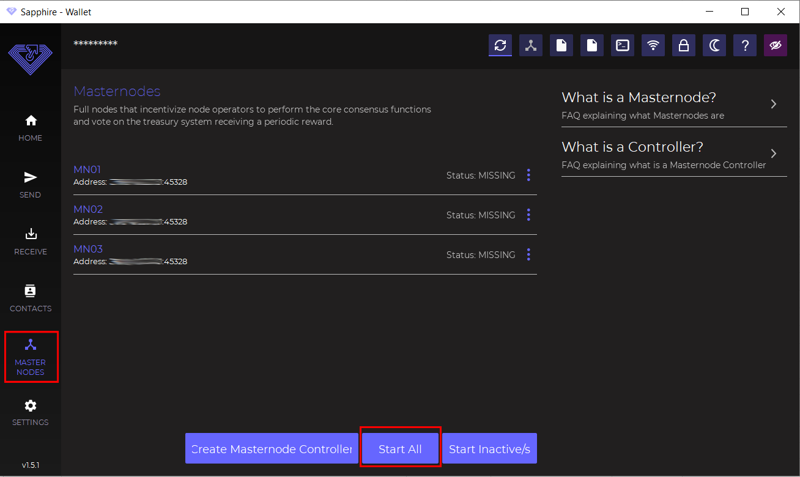<figcaption></figcaption></figure>

After executing the start command on the local wallet, if we reload the information available to our script running on the VPS, we can see that our masternodes have become active on the network.

<figure>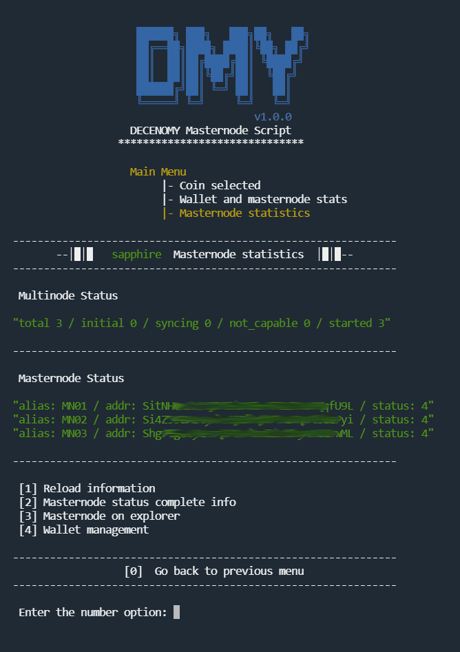<figcaption></figcaption></figure>

Going deeper into the script, we can see the classic masternode report with **status 4**. To do this, select **option 2**, "**Masternode status complete info**". This will give us more detailed information about the status of our masternodes in the network.

<figure>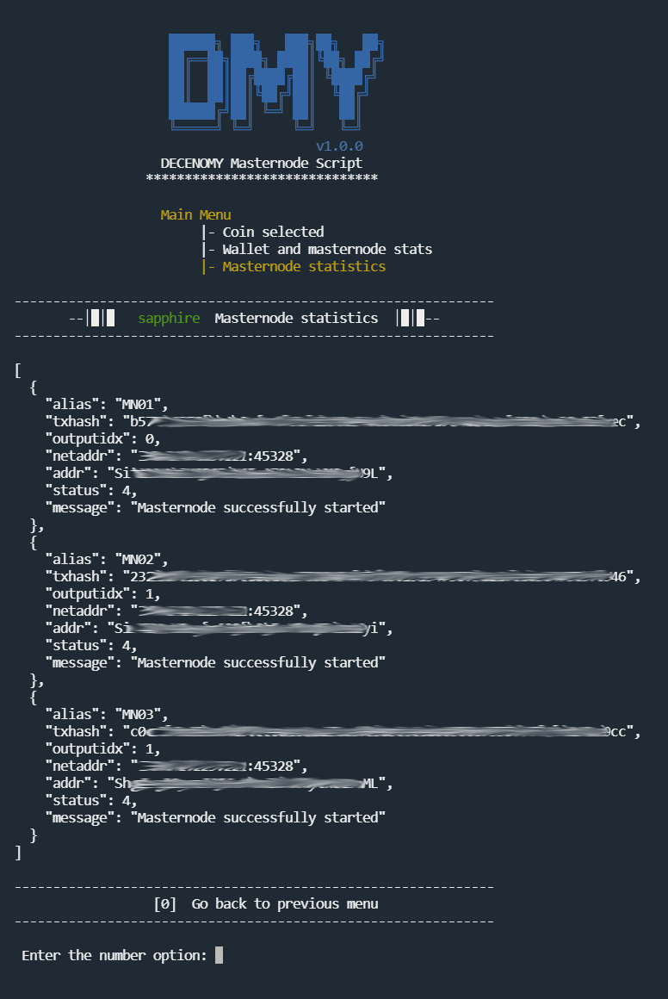<figcaption></figcaption></figure>

Last level to check if the masternodes are active and running in the network we can go back to the screen and select option **3 - Masternode on Explorer.** This will provide absolute proof that the masternodes are up and running on the network.

<figure>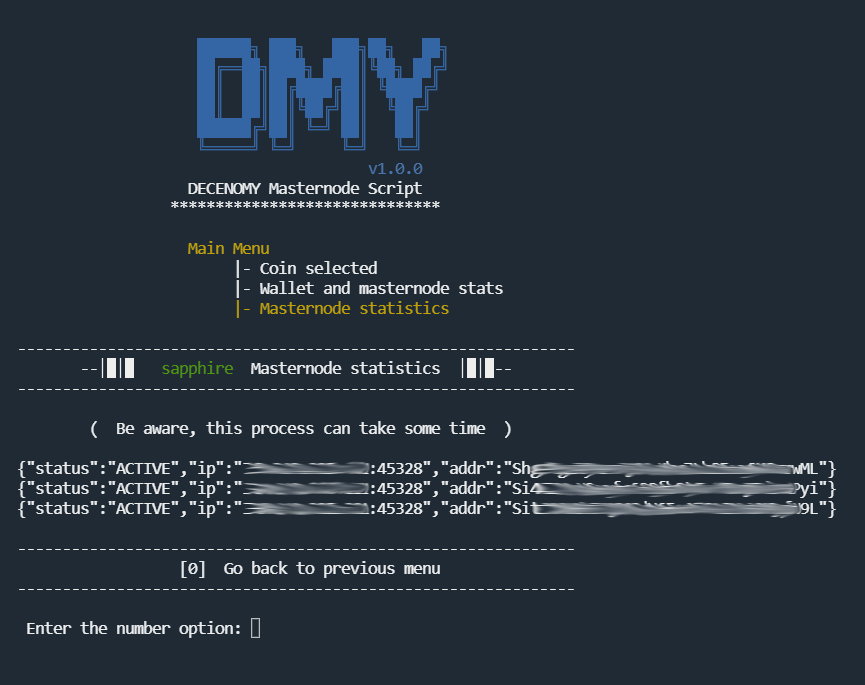<figcaption></figcaption></figure>

The masternodes are properly installed and active. As soon as they ping the network (approximately every 2 hours), their status will change to "**ENABLED**" and stay that way.\
\
At this point, the local wallet can be turned off without affecting the masternode rewards received, as they are tied to the blockchain and not the wallet's status. The VPS, however, needs to remain always on so that the masternode stays online for the network.
