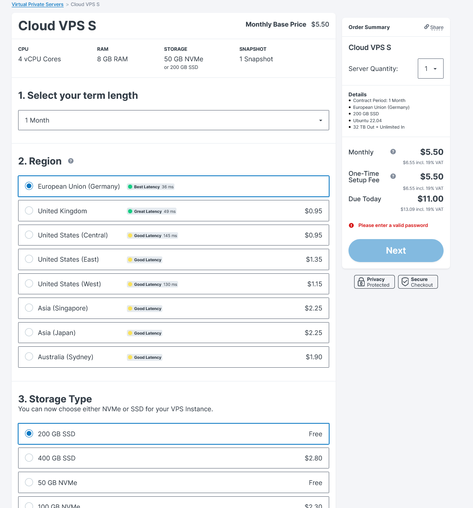
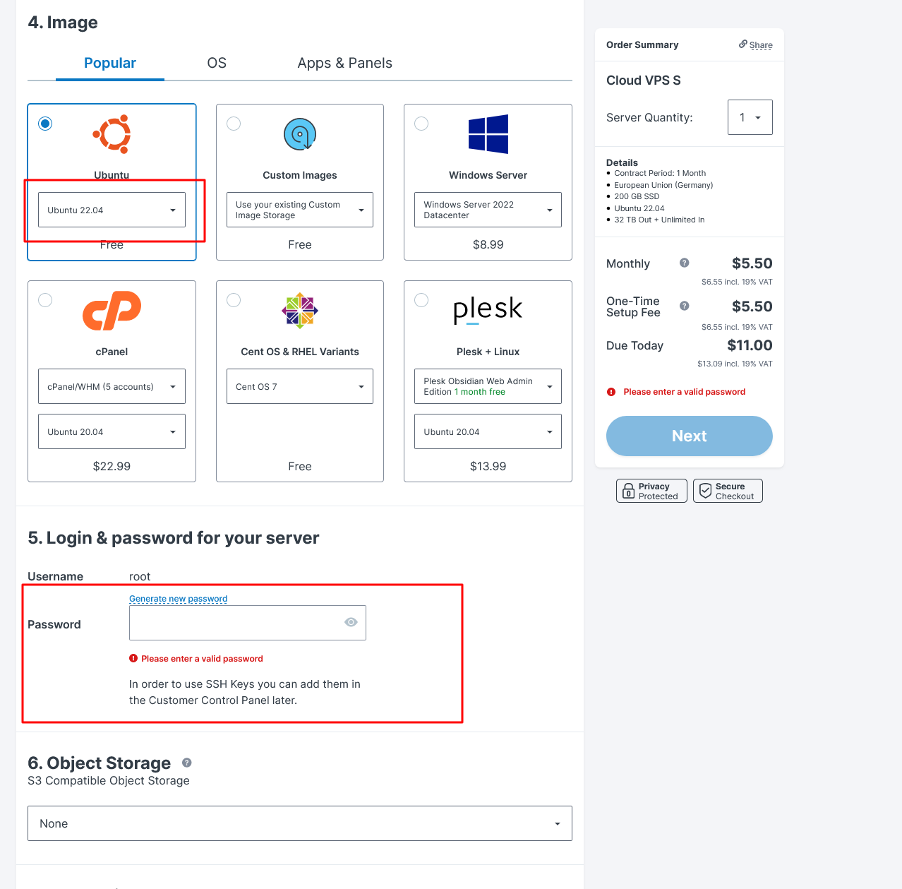
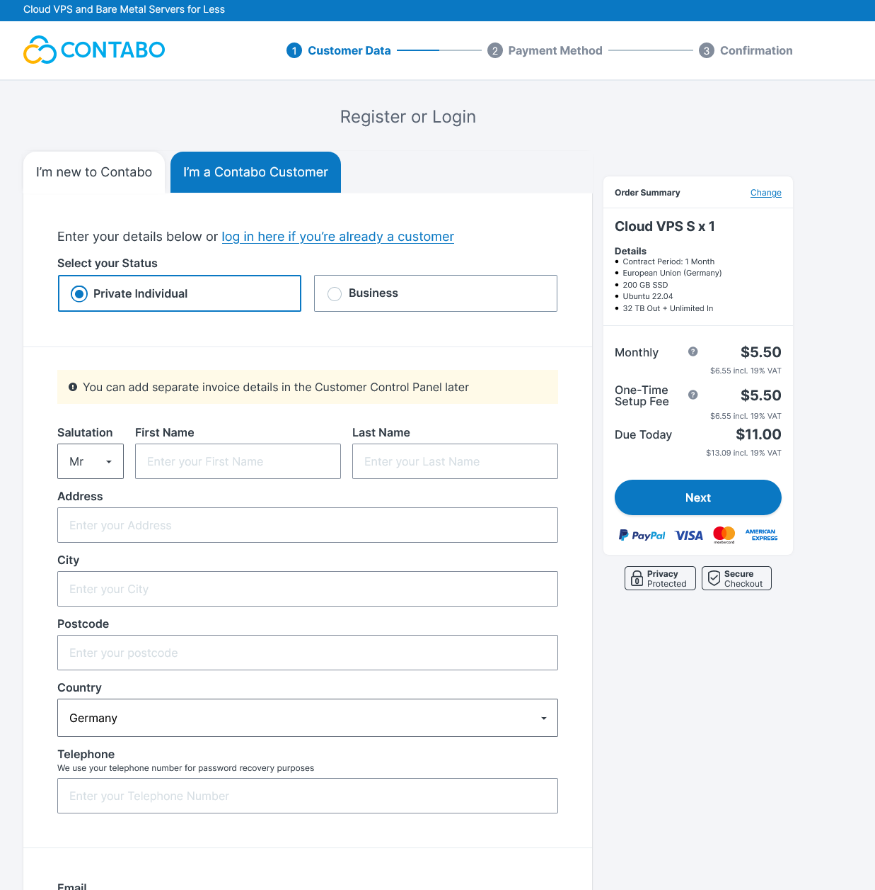
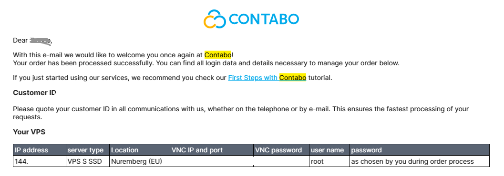
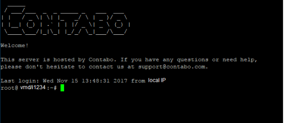

# ▪ Setting Up a Virtual Private Server (VPS)

To get our VPS we need to purchase it from a hosting provider.

In this guide, we are going to use [Contabo](https://contabo.com/en/vps/?utm\_source=cj\&utm\_medium=affiliate\&utm\_campaign=vps\&source=affiliate\&AID=12454592\&PID=6839992).

### Step 1 - Account Registration

* So let's open [Contabo](https://contabo.com/en/vps/?utm\_source=cj\&utm\_medium=affiliate\&utm\_campaign=vps\&source=affiliate\&AID=12454592\&PID=6839992)
* We will need to create an account and use either our credit card or PayPal as a method of payment. Once we are done, we will have access to the control panel.

### Step 2 - Ordering Process

* Now let's choose the "**VPS**" option under the 'New Order' section.

<figure><figcaption></figcaption></figure>

* On the next page, we select the **'CLOUD VPS S**' option

<figure><figcaption></figcaption></figure>

### Step 3 - VPS configuration

* Next, we need to configure our VPS by choosing the server location, preferably one nearest to our location. In this case, we choose '**European Union (Germany)'**.
* We also need to choose the '**Storage Type**' i.e. 200 GB SSD

<figure><figcaption></figcaption></figure>

* Whiles on the configuration page, we specify our Image:\
  1\. Ubuntu\
  2\. Select Ubuntu 22.04 from the drop-down menu
* Next, we have to set a password for our server. There is also an option to generate a new password.

<figure><figcaption></figcaption></figure>

### Step 4 - Payment

* Once we are done with the server configuration, we proceed to complete the payment.

<figure><figcaption></figcaption></figure>

### Step 5 - Connecting to the VPS

* We will receive a confirmation email when our order is successful. In the email, we will find details of our VPS (e.g. IP address and user name)

<figure><figcaption></figcaption></figure>

* Now, we will log into our server via Putty using our IP address, username, and password.

<figure><figcaption></figcaption></figure>

The connection to the VPS is now successful.
