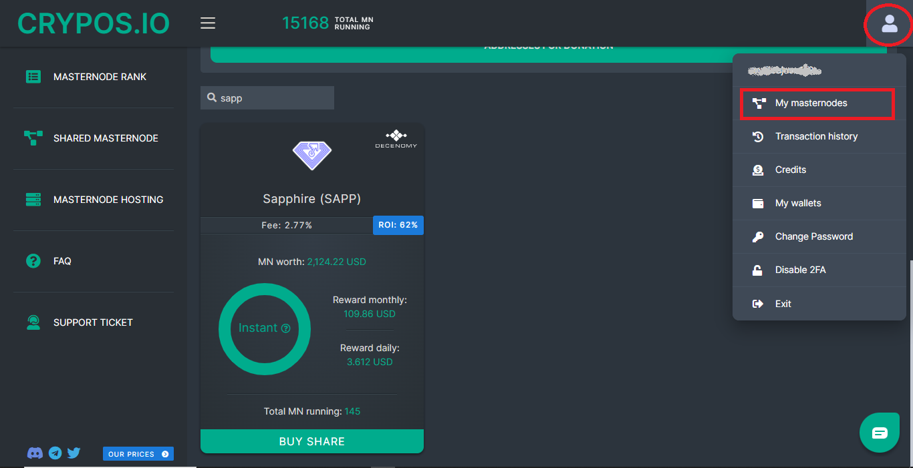

# ▪ Shared Masternode management on Crypos



In this guide, we will explain how to use Crypos.io for shared masternodes.

Now let's go to our browser and type [crypos.io](http://crypos.io/) in the address bar.

Then we register or log in if we are already registered.

Now that we are logged in, click on **shared masternode** in the left menu.

<figure><figcaption></figcaption></figure>

Once this is done, a page will open where we can choose the coin that interests us (in our case we choose Sapphire).

Then click on the **Buy Share** button.

<figure><figcaption></figcaption></figure>

Before proceeding (as we will see shortly) it will be necessary to provide the receive address of our wallet, where our rewards will be sent if they are not all reinvested.

Prior to that, you will be required to set up two-factor authentication (2FA).

So now let's go to our wallet and from the receive menu we copy our address.

<figure><figcaption></figcaption></figure>

At the time of making this guide, the minimum amount required to participate in a shared masternode is 200 SAPP. Click on the "add payment address" button to access the input field.

<figure><figcaption></figcaption></figure>

Now we can paste the address previously copied in the field and click on the "save" button:

<figure><figcaption></figcaption></figure>

Choose the "Deposit SAPP" option as we are going to be transferring the SAPP from our personal wallets.

<figure><figcaption></figcaption></figure>

In the next step, we can see the address to which we have to deposit our SAPP. There is also some information on our deposit below the deposit address.

<figure><figcaption></figcaption></figure>

Use the drop-down menu to specify the percentage of your reward you will want to reinvest.&#x20;

<figure><figcaption></figcaption></figure>

Now we send from our wallet to the address we see on Crypos, the coins we intend to invest.

<figure><figcaption></figcaption></figure>

The coins will be credited after 10 confirmations.

After reaching the 10 confirmations, we will see our masternode by clicking on the profile icon at the top right corner and then selecting **my masternodes**.

<figure><figcaption></figcaption></figure>

Now click on the "details" button.

<figure><figcaption></figcaption></figure>

On the next page, we can see the following information.

* Coins in shares (The coins we have invested)
* Coins value (The dollar value of our investment at the current price)
* 24h revenue (Expected returns in 24h)
* Overall revenue (The value of our earnings)
* ROI real (The real return on our investment)
* Reinvest (Here we can change the % of our reinvest value)

Below we can see the list of masternodes in which our coins are invested.

We can withdraw our funds at any time by clicking the icon highlighted in the image at the bottom right.

<figure><figcaption></figcaption></figure>

By going to our wallet we can check our received rewards.

<figure><figcaption></figcaption></figure>
