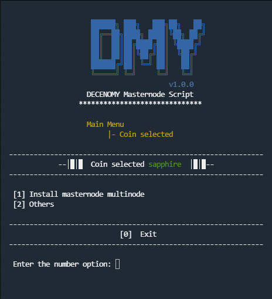
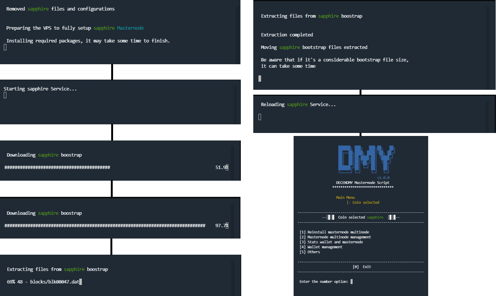
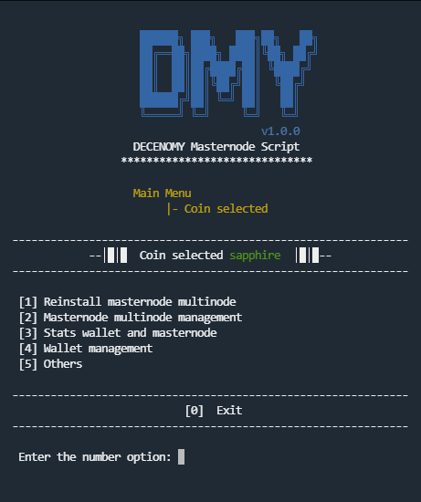

# Coin Selection

This menu has a dynamic result depending on what is installed in the system.\
\
If the coin masternode is not installed, you will be prompted to install it, as shown in the image below.

<figure><figcaption></figcaption></figure>

The master node installation process will display information about the current step. It is unlikely that the installation will get stuck, although the screen may appear frozen or the process may appear to have stopped. It is advisable to wait for some time before abruptly terminating the process. \
\
For reference, the complete automated process is shown in the image below.

<figure><figcaption></figcaption></figure>

Once the installation is complete, the coin selection screen for the installation will no longer be available and the coin selection screen will now be this one:

<figure><figcaption></figcaption></figure>

As you move forward in the script, everything is related to the coin selected in the main menu. In this case, it is Sapphire.\
\
Moving forward in the script, everything is related to the coin selected in the main menu. In this case, it is Sapphire.

**\[1] - Reinstall masternode multinode**

This option will reinstall the masternode wallet.

**\[2] - Masternode multinode management**

All the tasks related to the multinodes can be performed within this option. The available options are List, Add, and Delete.

**\[3] - Stats wallet and masternode**

This option will open the menus to view the statistics of the wallet and the statistics of the masternode.

**\[4] - Wallet management**

A handful of wallet management tools such as wallet update, bootstraps, peers management, addnodes, restart service, and delete wallet will be available in this option.
