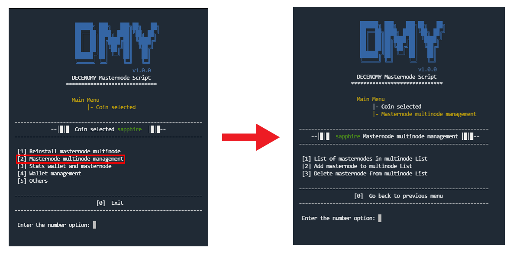
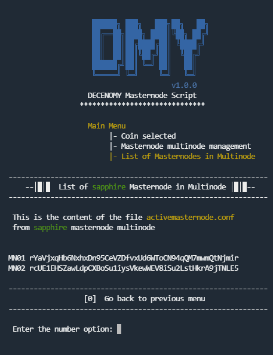
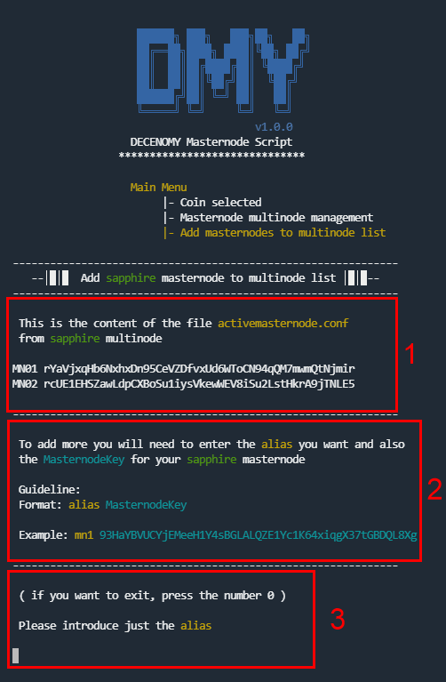
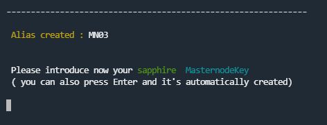
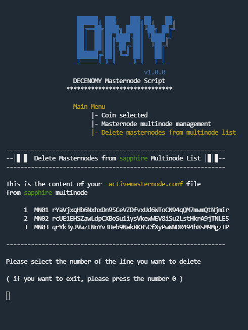

# Masternode multinode management

<figure><figcaption></figcaption></figure>

One place to manage everything related to multinode.

### \[1] - List of masternodes in multinode List

This section lists all the multinodes already installed in the system, taking into account the previously selected coin.

<figure><figcaption></figcaption></figure>

The multinode result is always sorted by the alias and then by the masternodeKey.

### \[2] - Add masternode to multinode List

This option allows you to add new multinode configurations and view those that have already been created or are currently being created.

<figure><figcaption></figcaption></figure>

#### **Section 1**

It displays the same information as the previous option for listing multinodes.

#### **Section 2**

This is a guide to help you easily understand how to fill out the multinode file.

#### **Section 3**

The multinode information must be entered in steps. \
First, the alias is requested, and then only the masternodeKey is requested. In this last step, the key can be entered manually or generated automatically by pressing the Enter key.

<figure><figcaption></figcaption></figure>

This screen also shows the previously introduced alias as a reference.

### \[3] - Delete masternodes from multinode list

This is an easy way to delete previously introduced multinode information.

<figure><figcaption></figcaption></figure>

Each line is numbered, making it easier to select the exact information to be deleted. After the selection is made, a confirmation screen is displayed and upon confirmation, the screen is updated with the final information.
