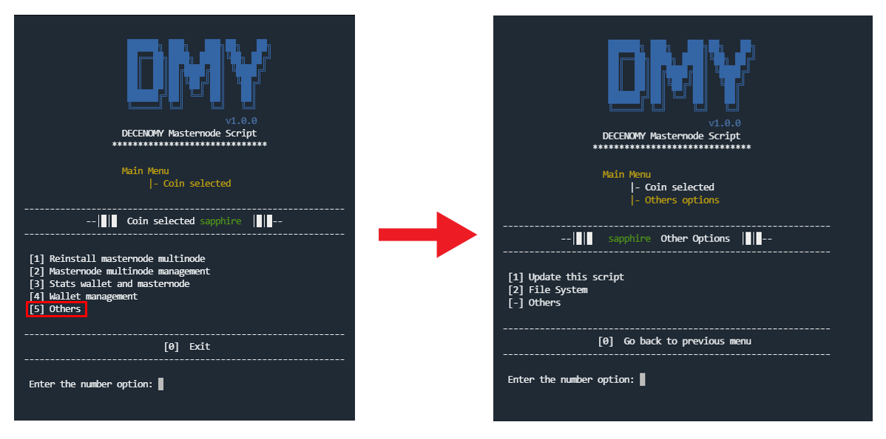

# Others

<figure><figcaption></figcaption></figure>

If you select **\[5] Others**, a screen appears with random options that are not suitable for other menus.

### \[1] - Update this script

This option can be used in case of a script update. The script will assist the user by reading the latest version presented on GitHub and currently installed on the system (the version in use). The user will then be prompted to decide whether or not to upgrade. ( The same menu can be accessed directly from the main menu option number 18 )

### \[2] - File System

Important information about the file system and file location related to the environment base described earlier.
