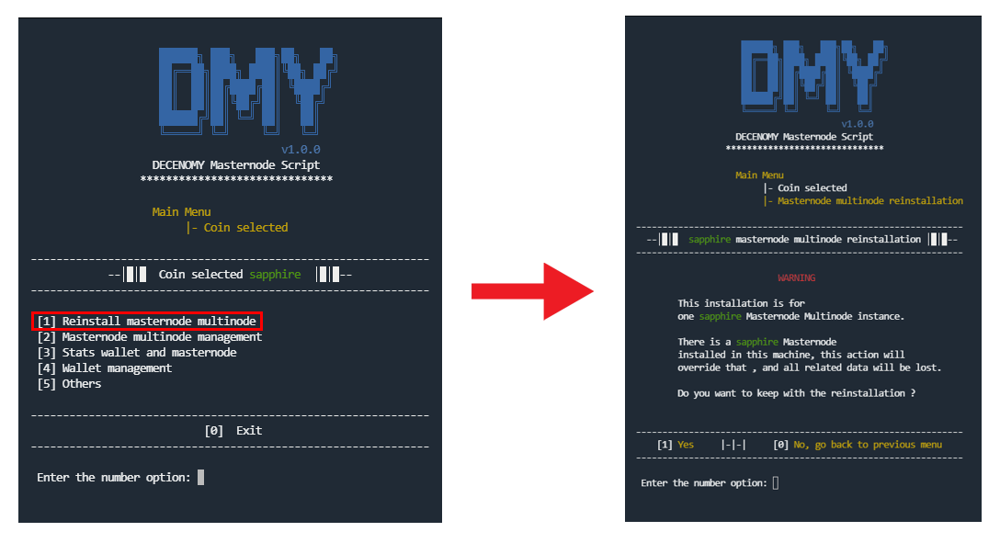

# Reinstall masternode multinode

<figure><figcaption></figcaption></figure>

This option will perform a new installation of the masternode wallet in the system. This action will delete all previous files related to the previously selected coin. \
\
A warning screen will be displayed after selecting this option, informing the user about the upcoming steps related to the action.
