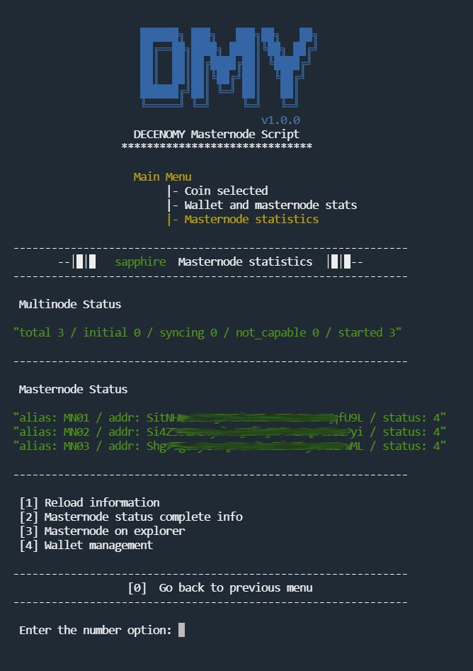
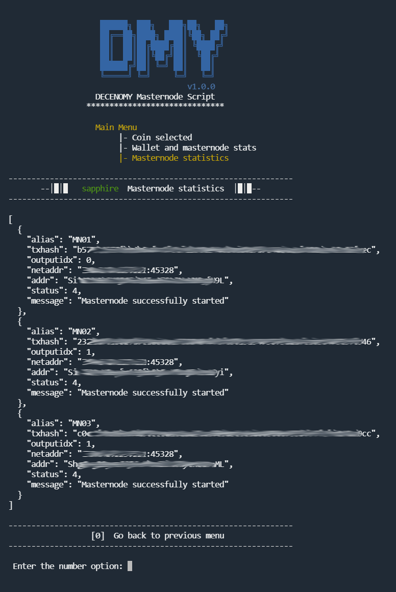
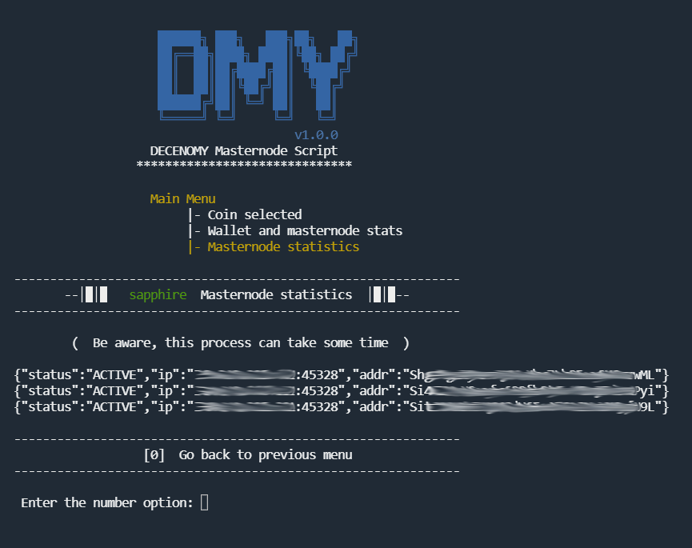

# Stats wallet and masternode

<figure><figcaption></figcaption></figure>

When selecting **\[3] Stats Wallet and masternode**, a screen will appear with options to choose the desired type of statistics.

### \[1]- Wallet statistics

A comprehensive overview of all the information needed to keep track of the wallet associated with the masternode.

<figure><figcaption></figcaption></figure>

#### Section 1

The wallet version is displayed in this section, which shows the latest version presented on the GitHub repository of the coin being managed, as well as the version currently installed on the user's system.

#### Section 2

A more detailed check is provided to give an overview of the installed wallet and its performance:&#x20;

* The protocol version number of the running wallet.
* The number of incoming and outgoing connections, providing an overall report on connectivity with the network.
* Whether or not the wallet is synchronized with the blockchain.
* The last block the wallet captured from the chain.

#### Section 3

Using the latest block available on the explorer, the script pings the Decenomy explorer to get the exact hash of that block. \
The same procedure is done with the wallet, using the same block number used to ping the explorer. \
\
Ideally, the results should match. If they don't, we can easily identify a possible fork state of our wallet (or the network).

The **"Reload Information"** option is a simple action that refreshes the screen content to provide up-to-date information. This option can be selected as often as necessary.

If any of the reported information is incorrect, the **"Wallet Management"** option will be useful. It takes the user to another screen with numerous options for managing the wallet. This option is also available directly from the **"Coin Selected"** menu.

### \[2] - Masternode statistics

Detailed information about masternodes running in the system

<figure><figcaption></figcaption></figure>

* _**Multinode Status**_\
  Displays information about the entire broadcast of the multinode
* _**Masternode Status**_\
  Retrieves information about each masternode and reports its status on the network. **Status: 4** is the default to report that it is running correctly.

#### \[1] - Reload information

This option is a simple action that refreshes the screen content to provide up-to-date information. This option can be selected as many times as needed.

#### \[2] - Masternode status complete info

Classic view of each masternode, with more detailed information about its status in the network

<figure><figcaption></figcaption></figure>

#### \[3] - Masternode on explorer

This option will ping the Decenomy explorer using the VPS IP to check if the masternode is actually running and broadcasting information to the blockchain. This process and the information provided will help avoid the need for the user to check the explorer themselves, making this tool the only place needed to check the real state of the masternode.

<figure><figcaption></figcaption></figure>

#### \[4] - Wallet management

If any of the reported information is incorrect, this option will be useful. It will take the user to another screen with numerous options for managing the wallet. This option is also available directly from the **"Coin Selected"** menu.
