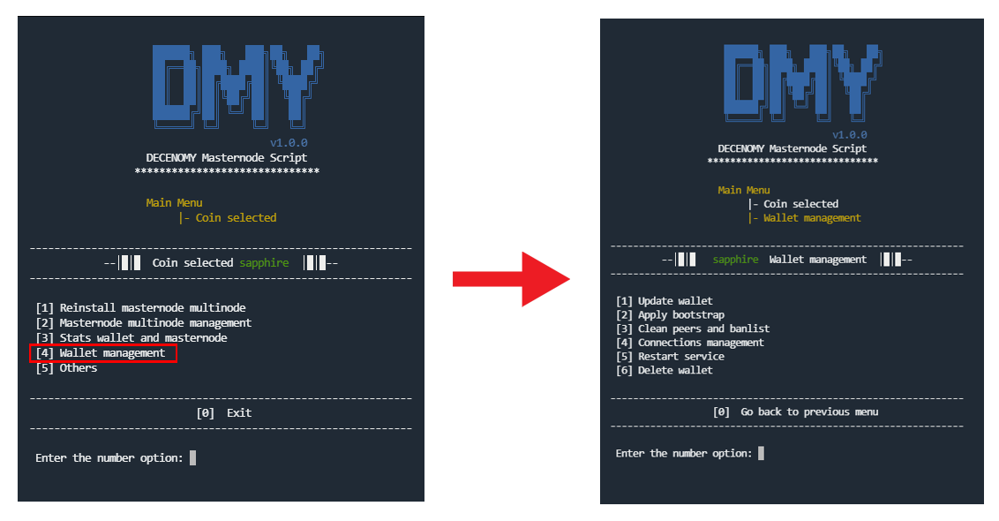

# Wallet management

<figure><figcaption></figcaption></figure>

When selecting **\[4] Wallet management**, a screen will appear with options to fully manage the masternode wallet.

### \[1] - Update wallet

Similar to the **"Wallet statistics"** options we checked earlier, the wallet version from Github and the wallet installed in the system will be displayed on the screen before confirming to update the wallet. This method will not destroy the already set masternode; it will only change the binaries related to the wallet and restart the service (not the masternode). Such a process is useful in case of a mandatory wallet release or any other wallet release that needs to be updated.

### \[2] - Apply bootstrap

This option downloads an official bootstrap from the Decenomy Explorer and replaces the existing files with the newly downloaded ones. The bootstrap is used in cases where a fast sync is needed or when a fork in the wallet is detected. It's the safest way to quickly synchronize to the current blocks of the blockchain in question. This method does not destroy the already set master node, it only changes the chain block related files.

### \[3] - Clean peers and banlist

In some cases of extremely poor connectivity, it may be necessary to clean certain files such as peers.dat and banlist.dat. This option will perform this process and restart the wallet service. This method will not destroy the already set masternode; it will only clean the peers.dat and banlist.dat files.

### \[4] - Connections management

This option runs the method for adding connections, also known as addnodes, to improve connectivity.

* _**List of extra connections on the wallet**_ \
  This option lists the connections that were previously added.
* _**Add connections to the wallet**_ \
  This option provides an easy method to add connections, along with a guideline to assist in the process. Please note that it's only possible to add one connection at a time. The connection to be added must have the following format **addnode=188.40.85.215:45328** otherwise, it will not work properly.
* _**Delete connections from the wallet**_ \
  This option provides an easy method to delete connections. You only need to type the number of the line (the number before the word "addnode") and press enter to delete it. Please note that it's only possible to delete one connection at a time.

### \[5] - Restart service

Because several routines in this script have a built-in service restart, we recommend that you only use this feature for isolated scenarios, such as collateral changes or in the event of a service failure.

### \[6] - Delete wallet

This is an easy way to delete the wallet. \
This method will remove all references to the wallet in the system as well as the masternode. \
Since the UserID is created each time the wallet is installed, it will also be deleted in this _delete wallet_ routine. \
Once this process is complete, the coin select menu will appear as if the wallet for the selected coin had never been installed.
