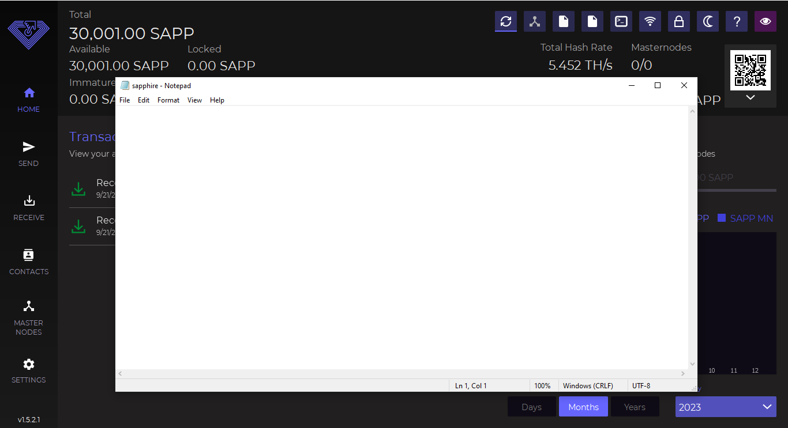

# ▪ Extra connections (addnodes)



In case we have problems connecting our wallet to the blockchain we need addnodes (peers).

In this guide, we will explain in a few simple steps how to add peers to your wallet.

First of all, let's open our wallet (in our case Sapphire)

<figure><figcaption></figcaption></figure>

Now we go to the top right and we will see the configuration file icon (in our case sapphire.conf).

As seen in the following picture

<figure><figcaption></figcaption></figure>

Now click on the configuration file icon to open it.

In case Windows asks us which program we want to use to open it, it is advisable to choose Notepad.

<figure><figcaption></figcaption></figure>

Now we go to [https://explorer.decenomy.net/](https://explorer.decenomy.net/) and search for the coin. (in this case Sapphire).

Then we click on the coin to access the "Overview" page.

<figure><figcaption></figcaption></figure>

As we can see on the next screen, we can choose "**Network**" from the left menu.

<figure><figcaption></figcaption></figure>

Now we choose from the list the option that corresponds to the version of our wallet (in this case 1.5.2.1)

**The version of our wallet can be found at the bottom left when the wallet is opened.**

<figure><figcaption></figcaption></figure>

Now we click on the "node list" button next to our preferred wallet version, this window will open and we copy the addnodes.

<figure><figcaption></figcaption></figure>

We go back to the Notepad to paste the addnodes.

<figure><figcaption></figcaption></figure>

Now we can save and close the configuration file as seen in the picture below:

<figure><figcaption></figcaption></figure>

Once this is done, we close and restart our wallet to apply the changes.\
Now our wallet is ready to be used!
