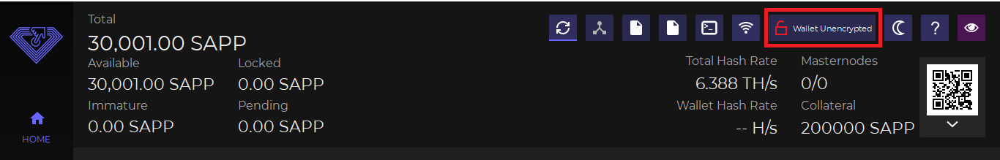
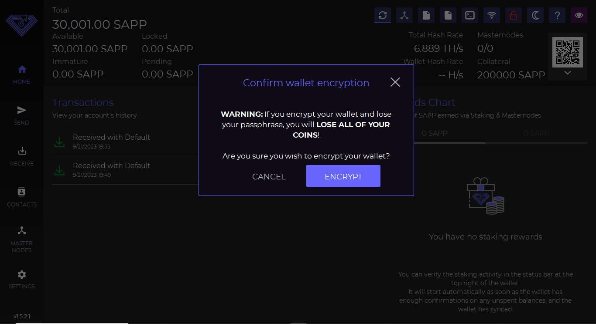

# ▪ Encrypting a wallet



First, let's open our wallet (in this case Sapphire). After this, as we can see in the image below, there is a padlock icon that is used to encrypt our wallet.

**It is important to encrypt our wallets to ensure greater security for our coins.**

<figure><figcaption></figcaption></figure>

Now let's click on the padlock icon and the following window will open.\
\
**We recommend that you put a secure password that is not already used elsewhere.**

**It is important to take care not to lose this password because without the password it will no longer be possible to access funds.**

Then we click the "OK" button

<figure><figcaption></figcaption></figure>

A further confirmation screen will open and we will click the ENCRYPT button.

<figure><figcaption></figcaption></figure>

Once this is done, a further confirmation window will open and the wallet will be closed to complete the operation.

<figure><figcaption></figcaption></figure>

Now we can restart our wallet for the encryption to take effect. You will be required to enter your password anytime you send funds or perform other operations that require it.

<figure><figcaption></figcaption></figure>
