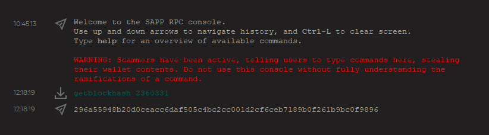
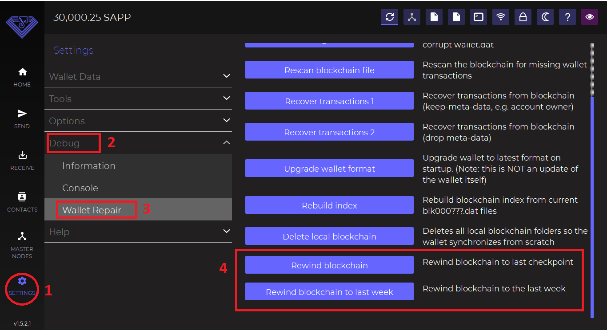

# ▪ How to Identify and Fix a Fork

### What is a Fork?

A fork in the context of blockchains is when changes are made to the blockchain's protocol which usually results in two separate versions of the blockchain.

Because blockchains are often updated to ensure security and embed new features, there is the need to be on the lookout for instructions on how to update your wallet if it's mandatory.&#x20;

Failing to respond promptly to upgrades can result in your wallet being associated with the incorrect blockchain.

### Possible Scenario your Wallet might be Forked

For example, you might have activated staking for a Decenomy coin, and in a short period, you realize you have received an outrageous amount of staking rewards.&#x20;

In such an instance, there is a possibility your wallet might have been forked. This means your wallet is on the wrong chain and these rewards earned are useless. Once the issue is resolved, these rewards will not show in your wallet as they aren't real.

### Verifying a Wallet Fork

Once you suspect a wallet fork, the following steps will help you to confirm if it's truly a fork. We will use SAPP for demonstration purposes.

* Open your wallet and go to "SETTINGS", then select "Debug". Next, you choose "Information" from the dropdown menu. We then navigate to the "Blockchain" section on the left side of the screen.
* The information of interest is:\
  1\. Current number of blocks: **2360341**\
  2\. Last block hash: **616851ded4d975e3dc331a0ecf894bd5814a4b27aaf5e46118bd1adf8e8b8b0d**

<figure><figcaption></figcaption></figure>

On the SAPP explorer, we compare the "Current number of blocks" and "Last block hash" from the wallet to ensure they match.

<figure><figcaption></figcaption></figure>

If we confirm the block hashes of both the wallet and the explorer are the same, then our wallet is on the right chain. However, if the hashes are different, then it indicates a fork.&#x20;

NB: In some cases, it is preferable to use previous blocks in our wallet as bases for the comparison. This is because new releases have self-fork management and the explorer takes a while to index. This causes a difference in the hashes when using the most recent block.

To check the hash of a specific block in our wallet, we do this instead:

* Open your wallet and go to "SETTINGS". Next, we choose 'Debug' and then 'Console"
* We use the command **`getblockhash`** with the block number we want its hash. \
  e.g., **`getblockhash 2360331`**

<figure><figcaption></figcaption></figure>

We get a response with the hash as shown in the image below:

<figure><figcaption></figcaption></figure>

We then have to compare the hash to that of the explorer to see if they match

&#x20;

<figure><figcaption></figcaption></figure>

### Resolving a Fork

* Go to "SETTINGS" in your wallet. Select 'Debug' and then 'Wallet Repair'. Scroll down to the end&#x20;
* First, we start by selecting the "Rewind blockchain to last week" option
* If it doesn't resolve the issue, we then proceed with the "Rewind blockchain" option. Hopefully, that should put your wallet on the right chain.

<figure><figcaption></figcaption></figure>
