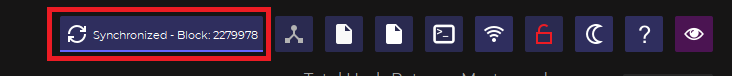

# ▪ Fast sync with a Bootstrap



In case there are any synchronization problems with your wallet, it is useful to know how to use a bootstrap (i.e. an archive containing the blockchain files).\
It is highly recommended to backup your wallet.dat file before making these operations.\
If you don't know how please refer to our guide **“How to make a backup on a USB stick”**\
Done this, if your wallet is open you have to close it.

So now let's go to the site [https://explorer.decenomy.net](https://explorer.decenomy.net/) as in the image:

<figure><figcaption></figcaption></figure>

After that, we choose in the bar at the top the coin that interests us (in our case Sapphire), and we click on the link in the table below as in the image:

<figure><figcaption></figcaption></figure>

This takes you to the overview page of the coin in question. In our case, we got sent to the landing page of the SAPP coin.

NB: Alternatively, you can access the overview page of any Decenomy coin by choosing "Overview" from the menu on the far left of your screen.

What we have to do next is locate the "download" button as indicated in the image below and click on it to start downloading the bootstrap file onto your computer.

<figure><figcaption></figcaption></figure>

Once this is done we have to go to the taskbar (in this case Windows).

Type in the search box `%appdata%` and press enter.

<figure><figcaption></figcaption></figure>

Afterward, a screen containing multiple folders will appear, and you should select your specific folder (in this case, Sapphire) and click to open it.

See image:

<figure><figcaption></figcaption></figure>

Now we need to delete some folders and files, as highlighted in the image:\
**it is important not to remove the "wallet.dat" file and the "backups" folder.**

<figure><figcaption></figcaption></figure>

Once this is done we will see the folder as in this image:

<figure><figcaption></figcaption></figure>

Now we can go to the downloads folder to extract the files from the previously downloaded bootstrap.\
As in the picture:

<figure><figcaption></figcaption></figure>

So let's copy the folders as in the image:

.png>)

Then we paste the files into the AppData \ Sapphire folder (where we previously deleted the files and folders).

As in the picture:

<figure><figcaption></figcaption></figure>

Now as we can see in the next image there are the folders that we have just extracted

<figure><figcaption></figcaption></figure>

We can then restart the wallet (in this case Sapphire) to check the status of the synchronization.

In the box at the top right, you can see the status of the wallet synchronization.

<figure><figcaption></figcaption></figure>
