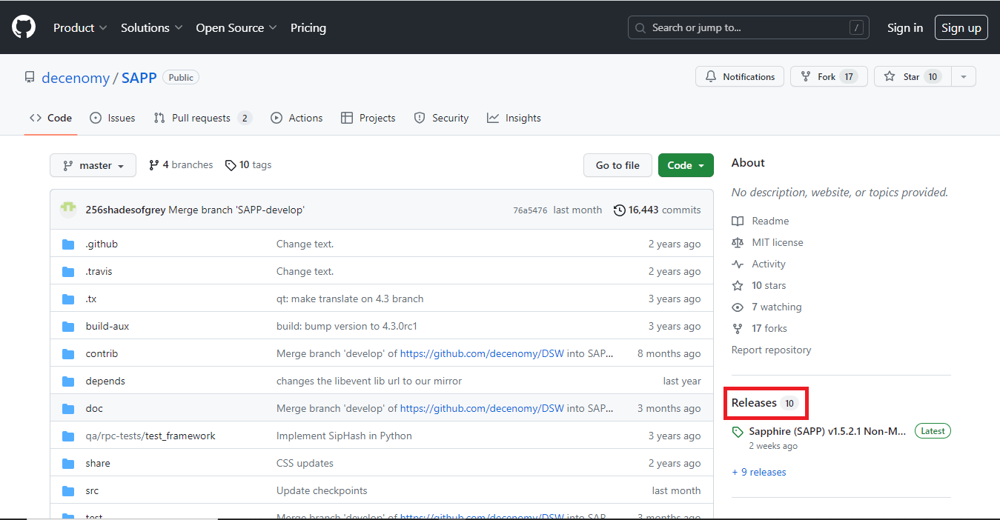
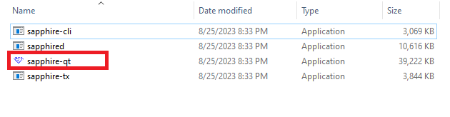

# ▪ Wallet update

This is important to ensure that your wallet is up to date with the latest security features, bug fixes, and other improvements.



In this guide, we will explain how to update a wallet:

Let's start by opening the wallet, in this case, Sapphire, to verify the wallet version located at the bottom left of the wallet window.

<figure><figcaption></figcaption></figure>

We can check for updates through our official channels (Twitter, Discord, website, or directly on GitHub)

After we have verified that there is an update (in some cases the updates are mandatory otherwise the wallet will stop working) we have to download the latest version. For Sapphire, you can locate it on GitHub using the following link:

[<mark style="color:blue;">https://github.com/decenomy/sapp</mark>](https://github.com/decenomy/sapp)

To access the latest version on GitHub, simply copy and paste the GitHub address into the address bar, as shown in the image below:

<figure><figcaption></figcaption></figure>

Once you are on GitHub, Click on the RELEASES link as shown in the image below:

<figure><figcaption></figcaption></figure>

This screen will appear:

<figure><figcaption></figcaption></figure>

Apparently, the latest version is v1.5.2.1, which differs from our current wallet version (v1.5.2.0).

Now, we need to select the appropriate version for our operating system, which, in this instance, is Windows. For Windows, you should choose the file named '**SAPP-1.5.2.1-Windows.zip**'.

<figure><figcaption></figcaption></figure>

Once the file has been downloaded, we can go back to our wallet to close it.

Once this is done, go to the download folder and extract the zip file which contains the new version of the wallet as in the image below:

<figure><figcaption></figcaption></figure>

Once the file has been extracted we can copy "**sapphire-qt**" and paste it into the Sapphire wallet folder on our computer. This will replace the previous version.

<figure><figcaption></figcaption></figure>

An easy way to locate the Sapphire wallet folder is to find the "Sapphire Core" shortcut on our desktop. Right-click on the icon and select "Open file location" as seen in the image below:

<figure><figcaption></figcaption></figure>

Upon selection, you will be directed to the correct folder where you should paste the '**sapphire-qt**' file. Confirm the replacement of the file, and you're all set to proceed.

<figure><figcaption></figcaption></figure>

\
Now you can start your wallet, which has been updated and is now ready for use.
