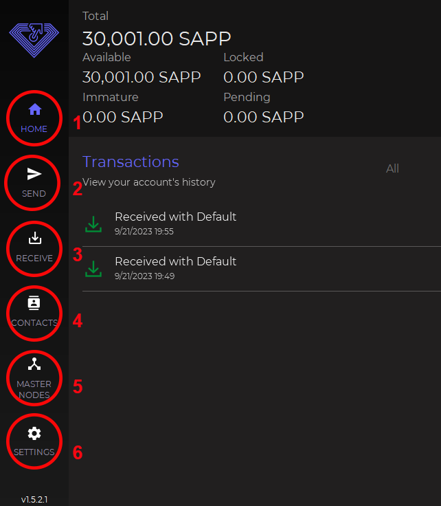
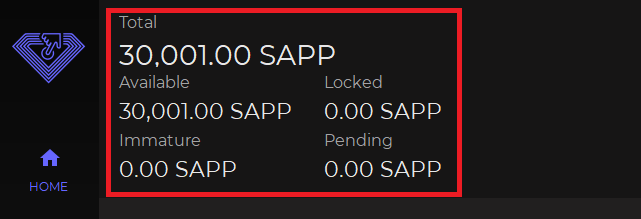
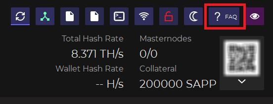

# ▪ How to use the DECENOMY wallets



So let's open our Decenomy wallet (in this case the Sapphire wallet).

<figure><figcaption></figcaption></figure>

Now we are going to explain the following functions step by step

1. Home
2. Send
3. Receive
4. Contacts
5. Masternodes
6. Settings

<figure><figcaption></figcaption></figure>

**Home**

On the "HOME" window, we can see the following:

* Total (the total of the coins owned)
* Available (the total amount of coins that can be spent)
* Locked (the total number of coins locked in the Masternodes)
* Immature (the coins that do not yet have enough confirmations to generate staking)
* Pending (coins received in unconfirmed transactions)

<figure><figcaption></figcaption></figure>

The HOME window also provides transaction history and a means to filter the results:

* All (you can see all transactions)
* Received
* Sent (transactions sent)
* Mined (coin mined or generated through mining)
* Minted (coin generated by staking)
* MN reward (coin generated by the masternode)
* To yourself (transactions sent to ourselves)

Through this filter, we can only view the transactions that interest us.

<figure><figcaption></figcaption></figure>

Beside the filter is the dropdown menu for sorting. We have the following options at our disposal:

* Date desc (from the most recent to the oldest transaction)
* Date asc (oldest to newest)
* Amount desc (from largest to smallest transaction)
* Amount asc (from smallest to largest)

<figure><figcaption></figcaption></figure>

On the far right section of the HOME window, we can see the following:

* Synchronized Block (shows us the status of the wallet synchronization)

<figure><figcaption></figcaption></figure>

* Staking active (indicates if staking is active)
* Staking disabled (staking is disabled)

<figure><figcaption></figcaption></figure>

* sapphire.conf (used to open the wallet configuration file)

<figure><figcaption></figcaption></figure>

* masternode.conf (used to open the masternode configuration file)

<figure><figcaption></figcaption></figure>

* Debug Console (to manually give commands to the wallet)

<figure><figcaption></figcaption></figure>

* Active connection(s) (the active connections in our wallet)

<figure><figcaption></figcaption></figure>

* Unlocked Wallet (used to unlock the wallet for any operation)
* Lock Wallet (used to lock the wallet)
* Staking Only (the wallet is unlocked only to allow staking)

<figure><figcaption></figcaption></figure>

* Dark Theme (used to switch from dark to light theme and vice versa)

<figure><figcaption></figcaption></figure>

* FAQ (frequently asked questions about the wallet)

<figure><figcaption></figcaption></figure>

* All visible (used to reveal or hide wallet details)

<figure><figcaption></figcaption></figure>

* Total Hash Rate (the total hash rate of the blockchain in question)
* Masternodes (shows the number of masternodes created and if they are running or not)
* Wallet Hash Rate (hash rate of wallet when staking is active)
* Collateral (value of current collateral)

<figure><figcaption></figcaption></figure>

In this section of the HOME window, we find the statistics of both staking and masternode rewards.

<figure><figcaption></figcaption></figure>

### **Send**

On the **Send** window, we can see.

* SAPP address or contact label (where we enter the recipient address )
* Amount (to enter the amount of coins to be sent)
* Address label (optional field, if the address is in our contact list the label will be displayed)

<figure><figcaption></figcaption></figure>

* Customize Fee (this option is used to customize our transaction fee)

<figure><figcaption></figcaption></figure>

It is advisable to use this option only if you are an expert user.

<figure><figcaption></figcaption></figure>

* Clear all (used to clear the fields seen previously)

<figure><figcaption></figcaption></figure>

* Add recipient (used to add additional recipients)

<figure><figcaption></figcaption></figure>

As we can see, a field has been added where you can enter both the address and the number of coins for a second recipient of our SAPP.

On the right, we find three dots where there is the option to add or remove this address from the contacts.

<figure><figcaption></figcaption></figure>

* Send (used to send the coins)

<figure><figcaption></figcaption></figure>

* Coin Control (used to select the inputs to spend and to block or unblock them)
* Change Address (to select a custom change address)
* Open URI (used to open a payment request from the web)

<figure><figcaption></figcaption></figure>

#### **Coin Control**

* Amount (the sum of the coins of the selected inputs)
* Quantity (the number of inputs selected)
* Fee (the preview of the transaction fees)

By clicking on the checkbox you can select or deselect the inputs that will be spent in our transaction.

Pressing OK confirms the changes made.

<figure><figcaption></figcaption></figure>

#### **Change Address**

This is used to customize the address for receiving the unspent coins when we transfer our coins.

<figure><figcaption></figcaption></figure>

#### **Open URI**

It is used to open a payment request from the web.

<figure><figcaption></figcaption></figure>

Reset to default (is used to cancel all changes made)

<figure><figcaption></figcaption></figure>

### **Receive**

* QR (the QR code associated with our SAPP receiving address)
* Add Label (used to assign a label to a generated address)
* Generate Address (used to generate a new address)
* Copy (to copy the address)

<figure><figcaption></figcaption></figure>

* Create Request (used to generate a QR to request a payment)
* My Addresses (list of our addresses)

<figure><figcaption></figcaption></figure>

#### **Create Request**

* Amount (insert the coins we want to request)
* Label (label to be associated with our payment request)
* Description (optional comment)
* Generate (used to generate the QR code)

<figure><figcaption></figcaption></figure>

#### **My Addresses**

* by Label (order by label)
* by Address (order by address)
* by Date (order by date)

<figure><figcaption></figcaption></figure>

### Contacts

* Add new contact

You can save a contact

<figure><figcaption></figcaption></figure>

### **Masternodes**

On the masternodes window, we can check the status of our masternodes and access some functions for their control.

* Info (used to see the information of your masternode)
* Start (to start the masternode)
* Delete (to delete the masternode)
* Reload ( used to reload masternodes)
* Create Masternode Controller (used to access a guided configuration of your masternode)
* Start Inactive/s (to start only inactive masternodes)

<figure><figcaption></figcaption></figure>

Here are some of the masternode states

**ENABLED:** Your masternode has been enabled and is running on the network

**ACTIVE:** Your masternode has been activated and is running on the network

**NEW\_START\_REQUIRED:** Your masternode needs to be restarted. Go to your local wallet and start your masternode

**EXPIRED:** Your masternode is not on the network. Simply restart the alias and wait 15 minutes. If that doesn't work, set up your masternode from scratch using a new transaction ID

**REMOVE:** Your masternode is down and removed from the network. Simply restart the alias and wait 15 minutes. If that doesn't work, set up your masternode from scratch using a new transaction ID

### **Settings**

* Wallet Data (access wallet features)
* Tools (access some utilities)
* Options (generic wallet settings)
* Debug (access console and repair options)
* Help (frequently asked questions)

<figure><figcaption></figcaption></figure>

#### Wallet Data

* Wallet (from this section you can back up your wallet or change your password if encrypted)

<figure><figcaption></figcaption></figure>

* Export Accounting (you can export the transaction history or your contacts in Excel format)

<figure><figcaption></figcaption></figure>

#### Tools

* Sign / Verify Message (from this section it is possible to sign a message to prove that you are the owner of an address, or to verify a signed message)

<figure><figcaption></figcaption></figure>

* BIP38 Tool (in this section it is possible to encrypt or decrypt a private key address pair)

<figure><figcaption></figcaption></figure>

#### Options

* Main (generic wallet options, for example, such as automatic start when the PC is turned on

<figure><figcaption></figcaption></figure>

* Wallet (from here you can change some connectivity options or staking settings)

<figure><figcaption></figcaption></figure>

* Display (you can change the language, the number of decimal units visible, or hide the staking graph)

<figure><figcaption></figcaption></figure>

#### Debug

* Information (wallet information such as synchronization status, number of connections, and wallet version)

<figure><figcaption></figcaption></figure>

* Console (used to access various wallet control commands)
* Console input (here you can type the desired command)

<figure><figcaption></figcaption></figure>

Below we list some of the most frequent commands

* `help` (a command that shows us the list of all available commands)
* `getinfo` (show wallet information such as version, protocol, blocks, and connections)
* `listtransactions` (show a list of the most recent transactions)
* `addnode` (to add new peers)
* `createmasternodekey` (to generate a new masternode key)
* `getmasternodeoutputs` (to see the list of eligible transactions to start a masternode)
* `setstakesplitthreshold` (used to divide your coins to optimize staking)

Wallet Repair

* Salvage wallet (try to recover private keys from a corrupt wallet)
* Rescan blockchain file (search for missing transactions in the entire blockchain)
* Recover transactions 1 (recover transactions from the blockchain while keeping the metadata)
* Recover transactions 2 (recover transactions from the blockchain without keeping the metadata)
* Upgrade wallet format (update the wallet.dat to the latest format)
* Rebuild index (rebuilds the blockchain indexes)
* Delete local blockchain (deletes all local blockchain files to synchronize the wallet from scratch)
* Rewind blockchain ( reverse the blockchain to the last checkpoint)
* Rewind blockchain to last week ( reverse the blockchain to the last week)

<figure><figcaption></figcaption></figure>

#### Help

* FAQ (opens a new window of frequently asked questions&#x20;

<figure><figcaption></figcaption></figure>

* About SAPP (Opens a new window with information on the software)

<figure><figcaption></figcaption></figure>

All DECENOMY coins use the same base code (DECENOMY standard wallet). So this guide is valid for all DECENOMY coins!
