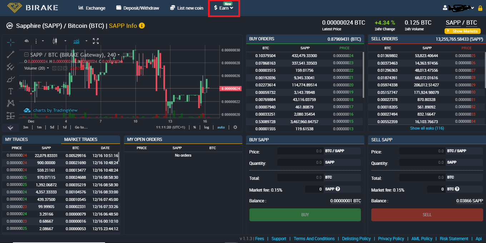

# ▪ Birake Exchange Affiliate Program

The Birake Exchange's referral program offers traders, influencers, content creators, and more the chance to earn a steady passive income by recommending Birake. You can earn up to a 15% commission on trading fees for a lifetime.

All you need is an account on Birake Exchange. Find your unique referral link, and begin sharing it with your audience to start earning rewards in various cryptocurrencies.

### How it works

Whenever someone registers an account with Birake Exchange using your link, you'll receive a share of all the fees generated from their trading activities.

The compensation for your efforts depends on the source of the fees. Your reward in cryptocurrency is determined by the trading pair. Referral earnings are deposited into your account and can be used without any restrictions.

### How to Join Birake Exchange Affiliate Program

* Sign in or open an account on Birake Exchange [https://trade.birake.com/](https://trade.birake.com/)&#x20;
* Next, click on the '**Earn**' button from the top menu bar

<figure><figcaption></figcaption></figure>

* Choose the '**Referral Program**' option from the drop-down menu

<figure><figcaption></figcaption></figure>

* Once on the referral program's page, you will have access to your custom invitation link.
* You have the option to copy the unique link or share it directly on social media

<figure><figcaption></figcaption></figure>
