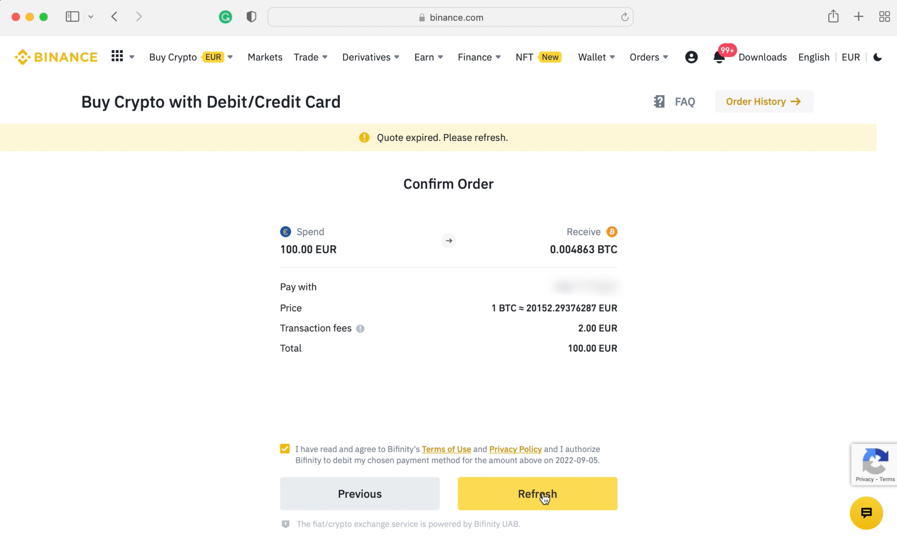
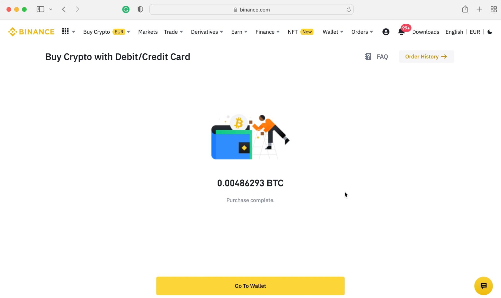
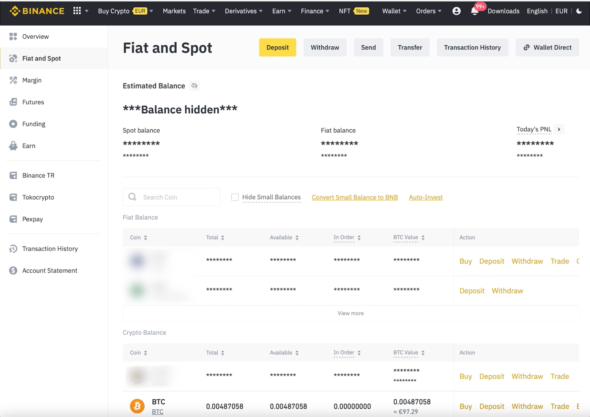
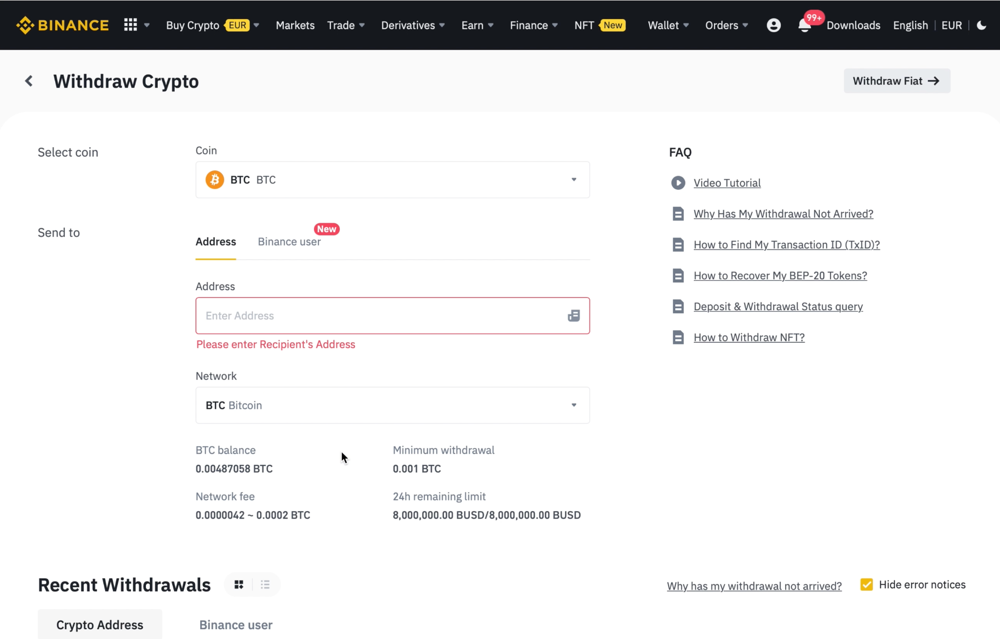
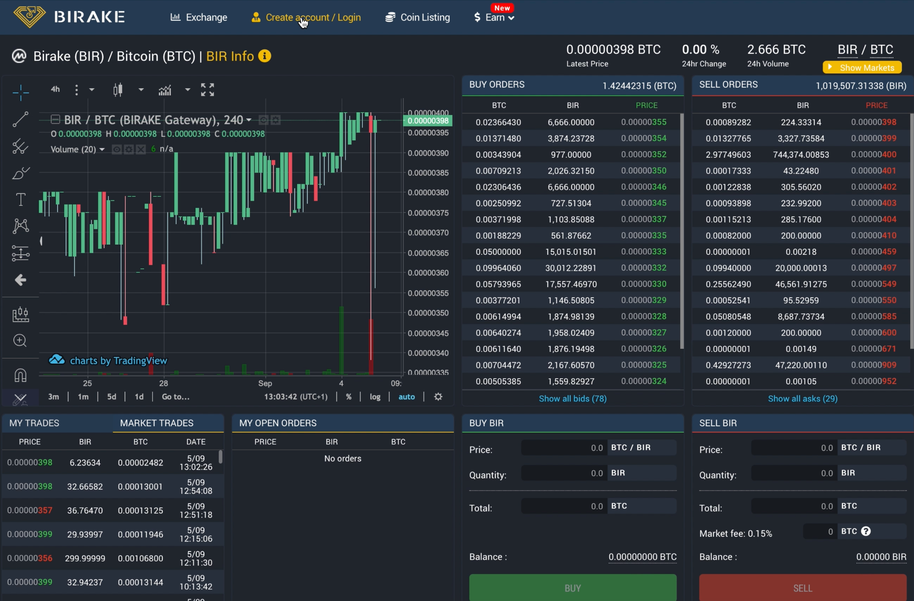
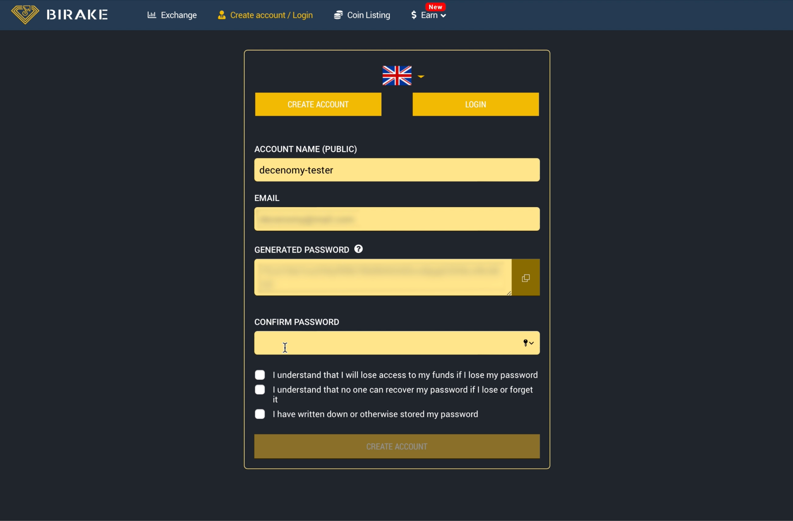
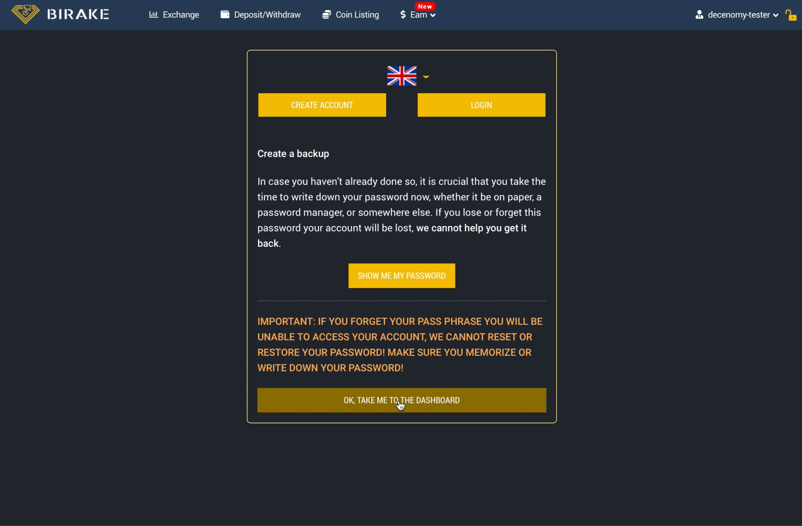
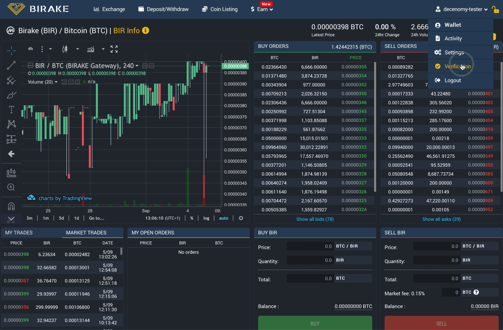
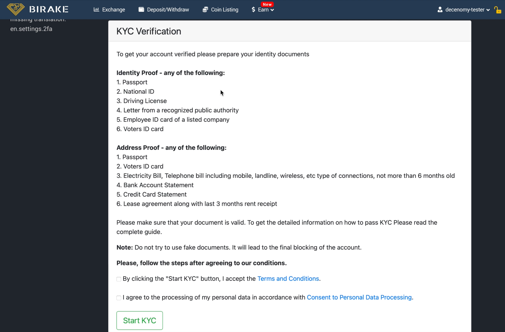
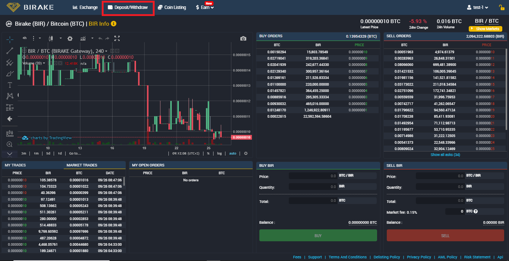

# ▪ Fiat to Crypto to Decenomy Coins



This guide is an introduction to acquiring crypto with FIAT. We will first purchase Bitcoin, and then exchange Bitcoin for one of Decenomy's Coins ( e.g. SAPP)

The primary objective of this tutorial is to provide guidance to individuals interested in getting started with cryptocurrencies but uncertain about where to begin.

To start with, let's navigate to Binance from Google. Always ensure you have the correct URL.&#x20;

For added security, it's recommended to visit binance.com directly or manually type the URL into your browser's address bar.

>)

If you already have an account, please proceed to log in. For those who do not have an account yet, please follow the next few steps to complete the registration process.

Once you click "register", we then go to "**sign up with phone or email**".

>)

At this stage, you can input your email address and choose a password of your preference. We then have to click on the Terms of Services and Privacy Policy checkbox. Please feel free to read these first.

The next is optional, should you wish to receive marketing mail, then please click the box. Finally, select "**Create Personal Account**".

>)

We can now return to the main page and Log in, where we can enter the email and password we used to register.

>)

The account being used for this tutorial already has 2FA set up. If you have just registered your account then it is an important security step to have.

>)

Once we enter the login details it will ask us to complete our 2FA that is in place. In this instance, once we click "get code" we will receive a 6-digit code to our phone.

Once you click 'Submit,' you will shortly be redirected to your main Binance dashboard page.

From here we get a brief overview of what coins we have and what sections we have our money in, as well as a number of options along the top tab bar.

It's advisable for new users to set up their verification early, as it can limit the range of operations you can perform on the platform until completed. This will also allow you to sign up for a Binance card which is very useful.

To complete the verification, navigate over to the icon as shown in the image below and scroll down to "identification".

>)

You will then be given a list of items needed to complete the verification such as passport details, address details, and a selfie for identification purposes.

The verification process may take some time, but once completed, you can access various additional benefits.

>)

Once complete we can then go back to the main page, and on the top bar we can see "buy crypto". From the dropdown menu, we have various methods to do this, including bank deposit and credit or debit card which is the one we will be looking at for this tutorial.

>)

After making your selection, you will be presented with options to specify how much you want to spend, in which currency, and which cryptocurrency you want to purchase. For now, let's purchase 100 euro worth of Bitcoin.

>)

To do this, as you can see we need to add a new card to our account.

>)

Once we click on "Add Card", we are prompted to enter the card details, as well as other required information such as address and postcode, etc.

After filling in all the required information, simply click 'Confirm,' and you will observe that the card has been successfully added to your account.

Next, just click "Continue".

It will now ask us to confirm the purchase. However, as the price of Bitcoin is constantly changing we only have 10 seconds to confirm it otherwise we will need to hit "refresh" so the price will update again to match the market price.

When you are ready, click on "confirm".

Please allow the system a few minutes to process your card. Shortly, you will see a message stating 'Purchase Complete' along with the amount of Bitcoin you now own.

Next, select "Go to Wallet".

In order to buy Decenomy Coins we now need to withdraw the Bitcoin to Birake exchange.

After clicking 'Withdraw,' you'll be taken to the withdrawal page. Here, you may notice that you're on the 'Withdraw Fiat' page. To switch to 'Withdraw Crypto,' simply select the 'Withdraw Crypto' option located at the top right.

Should you wish to withdraw fiat in the future, just simply switch back.

At this point, we can see BTC is already selected as the coin we want to withdraw.

We can also select Bitcoin from the network dropdown.

However, at the moment we don't have a BTC address we want to withdraw to, so let's head over to Birake Exchange and set up an account there.

On the URL bar, we type trade.birake.com or alternatively go to birake.com and navigate to the exchange.

We now want to go to "create account".

Fill out the registration form with your preferred username and email. You will then see an auto-generated password. This password cannot be changed and it is the private key to your birake wallet.&#x20;

It should be written down and kept in a safe place. To continue we can copy the password and paste it into the confirm password box when ready.

We then need to run through some additional checks of importance. Once you are happy and understand these, then hit "Create Account".

This action will trigger an additional screen to remind you of the importance of safely storing your password. Ensure you have recorded it in a secure place.

Next, click "Take me to the Dashboard".

Similar to Binance, at this point, we must verify our account. From the dropdown menu on the top right select "verification".

A checklist of the documents needed is then displayed. Once you have these ready then click the two check boxes if you agree with them, and select "Start KYC".

After completing the verification process, it may take up to 48 hours to become verified, although it often happens sooner.

Now back on the exchange, we can go to the Deposit and withdraw section.

<figure><figcaption></figcaption></figure>

From here we now need to select BTC from the dropdown list. Always double-check to ensure the correct coin is selected, as transactions cannot be reversed.

Now we can see the BTC address to deposit to. We can select "Copy Address" or highlight the address and copy it. Ensure the complete address is copied

<figure><figcaption></figcaption></figure>

Now that we have the address copied we can go back to Binance and paste it in there.

Then double-check we still have Bitcoin selected as the network.

Next, we can input how much we want to withdraw. In this case, we will select "MAX".

You can then see the amount we will receive when we scroll down.

When you are happy to continue, select "Withdraw".

<figure><figcaption></figcaption></figure>

Review the transaction and click on 'Continue' when you are sure.

<figure><figcaption></figcaption></figure>

Complete the security verification requirements to proceed

<figure><figcaption></figcaption></figure>

After satisfying the security verification requirements, you will receive a confirmation window indicating that your withdrawal is pending review. Click on "Completed" to finish the withdrawal process.

<figure><figcaption></figcaption></figure>

You will then be returned to the withdrawal page, down the bottom, you can see the transaction is being processed and awaiting confirmation.

<figure><figcaption></figcaption></figure>

The time it takes for the transfer to happen can vary greatly with Bitcoin. Usually, if sent from Binance, you will get an email confirming it has been completed.

After a while, we can go back to Birake and we can see the Bitcoin has arrived.

<figure><figcaption></figcaption></figure>

Once you have the Bitcoin credited to your Birake account, refer to [How to Buy Decenomy Coins on Birake](how-to-buy-decenomy-coins-on-heliobank.md). We demonstrate how to exchange Bitcoin for Sapphire (SAPP). The same procedure can be applied to other Decenomy coins.
