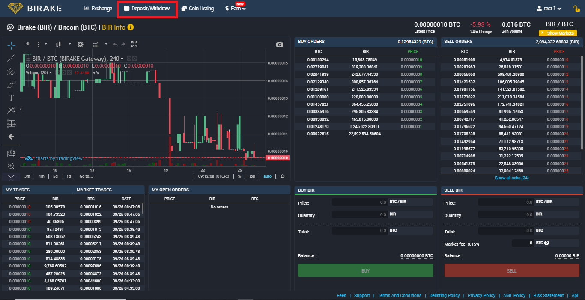

# Deposits and Withdrawals

In this quick and easy tutorial, we'll walk you through the steps to deposit and withdraw your assets on the Birake exchange platform. Let's get started!

### Deposits

* While logged in to your account, navigate to the top menu bar and select "**Deposit / Withdraw**". We are going to use Bitcoin (BTC) for demonstration.

<figure><figcaption></figcaption></figure>

You will be sent to the deposit and withdrawal page. From there we choose

1. BTC from the drop-down menu
2. Select **Deposit**
3. And copy the address provided

<figure><figcaption></figcaption></figure>

We can now send our Bitcoins to the newly copied deposit address.

After about a few minutes we will have our Bitcoins on Birake, as we can see from our Current balance:

<figure><figcaption></figcaption></figure>

### Withdrawals

* To initiate a withdrawal, you need to go to the deposit and withdrawal page from the main navigation menu. In this case, we will be using Sapphire (SAPP) for demonstration.
* Select SAPP from the dropdown menu

<figure><figcaption></figcaption></figure>

* After choosing SAPP,

1. Click on **WITHDRAWAL**
2. Then Click on **WITHDRAW NOW**

On the bottom left of our window is where we have our current balance.

<figure><figcaption></figcaption></figure>

* Now let's open our Sapphire wallet

1. Click on **Receive**
2. Copy the address

<figure><figcaption></figcaption></figure>

* Once the address has been copied, we return to Birake.

1. Click on **AVAILABLE** (to withdraw the full amount available)
2. Paste the address previously copied from our Sapphire wallet
3. Click **WITHDRAW**

<figure><figcaption></figcaption></figure>

* We confirm and wait for the withdrawal request to be processed.

<figure><figcaption></figcaption></figure>

* We will then check our Sapphire wallet in a while to confirm receipt.

<figure><figcaption></figcaption></figure>
