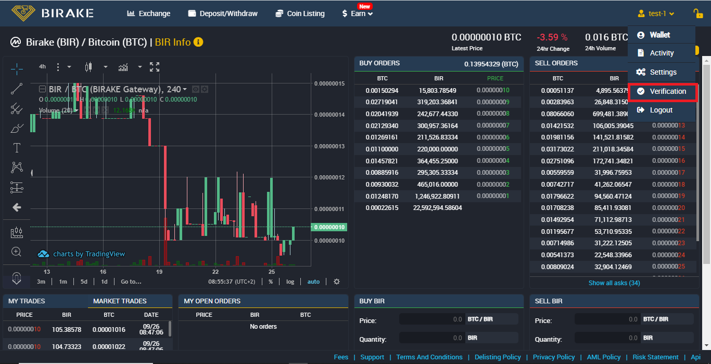

# User Account Creation and KYC Verification

### Birake Account Creation Process

* Head over to  [<mark style="color:blue;">https://trade.birake.com/</mark>](https://trade.birake.com/)
* Click on "**Create Account / Login**" from the top menu bar.&#x20;

You will be redirected to the account creation page where you will have to fill out the form with:

1. Your desired Account Name
2. Email address
3. The password is already generated. You just have to copy and paste it into the "**Confirm password**" field.
4. Select the three checkboxes to confirm you agree to the terms. Then click on the "**Create an accoun**t" button to complete the registration process.

<figure><figcaption></figcaption></figure>

We advise you to keep your password safe to avoid any difficulties accessing your account. Please store your password securely.

### Birake KYC Verification Process

After successfully creating an account, it will be necessary to verify it with an identity document. This will enable you to deposit and withdraw funds.

* Click on the profile icon at the top right corner of the screen and choose "**Verification**" from the list.

<figure><figcaption></figcaption></figure>

* Existing users are also required to undergo a new KYC process with the new provider. Please click on the '**RESEND**' button, and an email will be sent containing a link to complete the KYC process.

<figure><figcaption></figcaption></figure>

* To continue verification, follow the email by clicking on the red verification button. \
  Note that this notification is always sent to the email address you used when you first registered your account on Birake Exchange.

<figure><figcaption></figcaption></figure>

The KYC process verification requires a smartphone, so the necessary information will be introduced.\
\
If you are already following the previous instructions on this type of device, please ignore the next 2 points related to the phone number and you can jump directly to the privacy policy agreement.\
\
On the other hand, if you are doing this from any type of computer, please follow the phone number verification to continue your KYC session on the smartphone.

* To initiate the KYC process, you will be required to verify your phone number.

<figure><figcaption></figcaption></figure>

* Following that, you will receive an SMS on the provided phone number containing the KYC link. Ensure that you complete the process directly on your phone, as copying and pasting the link into your browser may not work.

<figure><figcaption></figcaption></figure>

* On the subsequent page, please agree to the privacy consent and click on **'Continue.**'

<figure><figcaption></figcaption></figure>

* Select the '**Capture my ID**' button to photograph the front page of your National ID card.

<figure><figcaption></figcaption></figure>

* Repeat the process for the back of your ID card by clicking on the **'Capture my ID**' button.

<figure><figcaption></figcaption></figure>

* After the ID verification, you will have the opportunity to review your ID details. While most fields will be automatically generated, it is crucial to verify their accuracy. If any information is incorrect, you will be able to make the necessary changes.
* Check the checkbox to confirm your agreement with the consent policy once again. When you are certain that your details are accurate, click on the "**My details are correct**" button.

<figure><figcaption></figcaption></figure>

* Next, you will be required to finalize the face verification process by recording a selfie video.

<figure><figcaption></figcaption></figure>

* Once you have finished the KYC process, you will be notified with a success message confirming your verification.

<figure><figcaption></figcaption></figure>

Accounts are usually verified within 2 - 3 mins. When your account is verified you will be able to make deposit and withdrawal.

<figure><figcaption></figcaption></figure>
