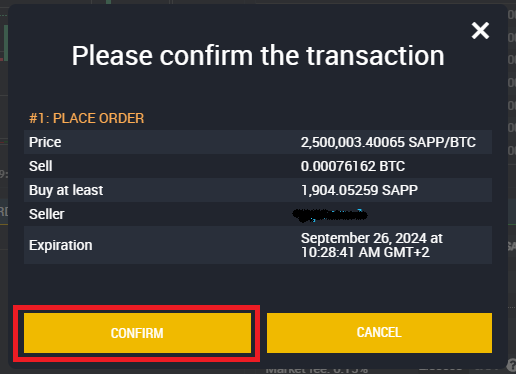

# ▪ How to buy Decenomy coins on Birake



In this guide, we will walk you through the steps needed to buy Decenomy coins on Birake.

First of all, we go to this link [https://trade.birake.com/](https://trade.birake.com/) then we create an account.

We recommend that you do not lose your password, otherwise, you might have issues accessing your account. (save the password in a safe place).

<figure><figcaption></figcaption></figure>

After creating an account, it will be necessary to verify your account with an identity document in order to deposit and withdraw (usually accounts are verified within 48 hours).

Click on the profile icon at the top right corner of the screen and choose "Verification" from the list.

<figure><figcaption></figcaption></figure>

On the next screen, you will be able to upload the required documents.

<figure><figcaption></figcaption></figure>

When our account is verified we will be able to make a deposit, in this case with Bitcoin.

So now we click on Deposit / Withdraw

<figure><figcaption></figcaption></figure>

Once this is done we will find ourselves on the deposit page

Now let's choose.

* BTC from the drop-down menu
* Choose Deposit
* Copy the address

<figure><figcaption></figcaption></figure>

We can now send our Bitcoins to the newly copied deposit address.

After about a few minutes we will have our Bitcoins on Birake, as we can see from our Current balance.

<figure><figcaption></figcaption></figure>

Now we have to go to

* Exchange
* Show Markets

<figure><figcaption></figcaption></figure>

Once this is done, a search bar will open where we can filter by entering a coin name. In this case, we input SAPP (Sapphire).

<figure><figcaption></figcaption></figure>

Now click on the SAPP market to enter the market page with the buy and sell orders.

<figure><figcaption></figcaption></figure>

Now we can proceed with the purchase.

We have 0.00076163 BTC available.

So we can buy SAPP for this value in the SELL orders table.

<figure><figcaption></figcaption></figure>

Now we need to click on the rows of the SELL table until the total of our order is equal to or greater than our Bitcoin balance.

In our case, the third row of orders in the table gives us a total higher than our Bitcoins available.

<figure><figcaption></figcaption></figure>

So you have to click on the available balance to buy the equivalence of SAPP with our BTC balance.

* Click on the Balance
* Click on BUY

<figure><figcaption></figcaption></figure>

Now a window will open confirming the operation. Then click CONFIRM.

<figure><figcaption></figcaption></figure>

Once the purchase is complete, we return to the Deposit / withdraw page.

And we choose SAPP from the dropdown menu.

<figure><figcaption></figcaption></figure>

Done this

* Click on WITHDRAWAL
* Click on WITHDRAW NOW

As we can see at the bottom left is our Current balance.

<figure><figcaption></figcaption></figure>

Now let's open our Sapphire wallet

* Click on Receive
* Copy the address

<figure><figcaption></figcaption></figure>

Once the address has been copied, we return to Birake.

* Click on AVAILABLE (to withdraw the full amount available)
* Paste the address previously copied from our Sapphire wallet
* Click WITHDRAW

<figure><figcaption></figcaption></figure>

We confirm and wait for the withdrawal request to be processed.

<figure><figcaption></figcaption></figure>

We will then check our Sapphire wallet in a while to confirm receipt.

<figure><figcaption></figcaption></figure>
