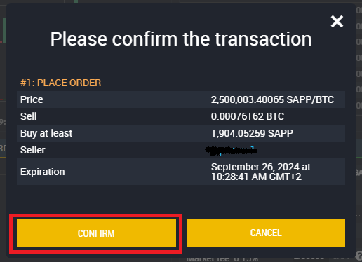

# Trade (Buy and Sell)

In this guide, we will walk you through the steps needed to buy Decenomy coins on Birake.

This is the third tutorial from the series [How to Buy Decenomy Coins on Birake](./). We assume you have successfully [created and verified your Birake account](user-account-creation-and-kyc-verification.md) by now. And most importantly [funded your account](deposits-and-withdrawals.md). &#x20;

* From the top menu go to&#x20;

1. Exchange
2. Then Show Markets

<figure><figcaption></figcaption></figure>

* Once this is done, a search bar will open where we can filter by entering a coin name. In this case, we input SAPP (Sapphire).

<figure><figcaption></figcaption></figure>

* Now click on the SAPP market to enter the market page with the buy and sell orders.

<figure><figcaption></figcaption></figure>

* Now we can proceed with the purchase. We have 0.00076163 BTC available and can buy SAPP for this value in the SELL ORDERS table.

<figure><figcaption></figcaption></figure>

* Now we need to click on the rows of the SELL table until the total of our order is equal to or greater than our Bitcoin balance. \
  \
  In our case, the second row of orders in the table gives us a total higher than our Bitcoins available.

<figure><figcaption></figcaption></figure>

* So you have to click on the available balance to buy the equivalence of SAPP with our BTC balance.

1. Click on the Balance
2. Click on BUY

<figure><figcaption></figcaption></figure>

* Now a window will open confirming the operation. Then click CONFIRM to place your order.

<figure><figcaption></figcaption></figure>
