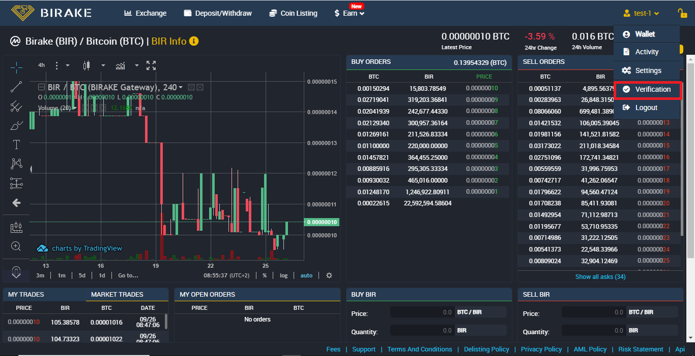

# User Account Creation and KYC Verification

### Birake Account Creation Process

* Head over to  [<mark style="color:blue;">https://trade.birake.com/</mark>](https://trade.birake.com/)
* Click on "**Create Account / Login**" from the top menu bar.&#x20;

You will be redirected to the account creation page where you will have to fill out the form with:

1. Your desired Account Name
2. Email address
3. The password is already generated. You just have to copy and paste it into the "**Confirm password**" field.
4. Select the three checkboxes to confirm you agree to the terms. Then click on the "**Create an accoun**t" button to complete the registration process.

<figure><figcaption></figcaption></figure>

We advise you to keep your password safe to avoid any difficulties accessing your account. Please store your password securely.

### Birake KYC Verification Process

After successfully creating an account, it will be necessary to verify it with an identity document. This will enable you to deposit and withdraw funds.

* Click on the profile icon at the top right corner of the screen and choose "**Verification**" from the list.

<figure><figcaption></figcaption></figure>

* On the next screen, you will be provided with all the documents required and a guide to complete the KYC process.&#x20;

<figure><figcaption></figcaption></figure>

Accounts are usually verified within 48 hours. When our account is verified we will be able to make a deposit.
