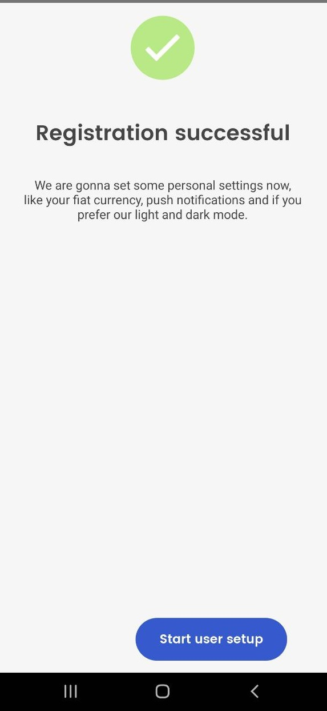
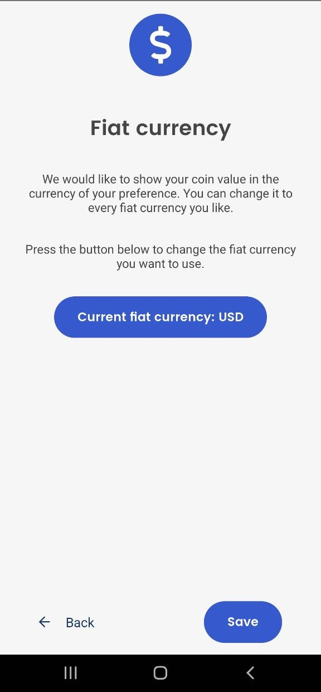
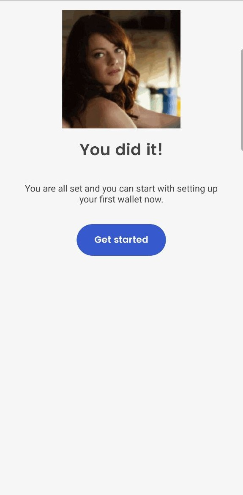
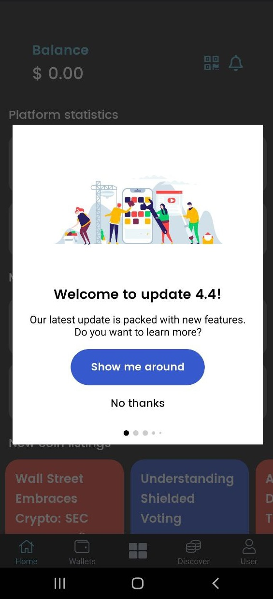

# ▪ Getting Started with Flits Wallet App

### Step 1

* To get started with the Flits Wallet you will need to download it from [<mark style="color:blue;">**Google Play Store**</mark>](https://play.google.com/store/apps/details?id=app.flitsnode.flits\&pli=1)
* Once, the installation is complete open the app to start the setup process
* On the first window, select the blue '**create a wallet**' button. [<mark style="color:blue;">**Learn how to recover your old wallet using the seed phrase**</mark>](how-to-recover-an-old-wallet-using-the-seed-phrase.md)

<figure><figcaption></figcaption></figure>

### Step 2

* Next, is the 'Welcome" page. Select the blue '**Start**' button to begin

<figure><figcaption></figcaption></figure>

### Step 3

* Flits Wallet is a non-custodial solution that gives you full control of your funds by handing you a seed phrase of 24 words.
* The seed phrase gives you access to your funds and needs to be stored offline.
* Select, '**Next**' to proceed to the verification page

<figure><figcaption></figcaption></figure>

### Step 4

* Verify your seed phrase by entering the words and then press the '**Verify**' button:

<figure><figcaption></figcaption></figure>

### Step 5

* If you correctly enter the 3 words from your seed phrase, you receive a successful message as shown below.
* Proceed by pressing the '**Start user setup**' button to begin some basic settings.

<figure><figcaption></figcaption></figure>

### Step 6

* Enable Push notifications to receive updates on your activities.
* Alternatively, skip to continue to the next step

<figure><figcaption></figcaption></figure>

### Step 7

* Choose and save your preferred FIAT currency

<figure><figcaption></figcaption></figure>

### Step 8

* Switch to dark mode if you wish to&#x20;

<figure><figcaption></figcaption></figure>

### Step 9

* Congrats! You just finished with the setup process. Select the '**Get started**' button and explore the Flits Wallet

<figure><figcaption></figcaption></figure>

### Step 10

* Select '**Show me around**' to learn about some of the cool features of the app or '**No thanks**' to access the wallet.

<figure><figcaption></figcaption></figure>

### Step 11

* Any of the options in the previous step will send you to the wallet overview

<figure><figcaption></figcaption></figure>
