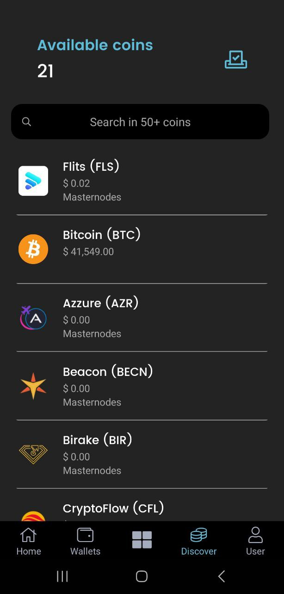
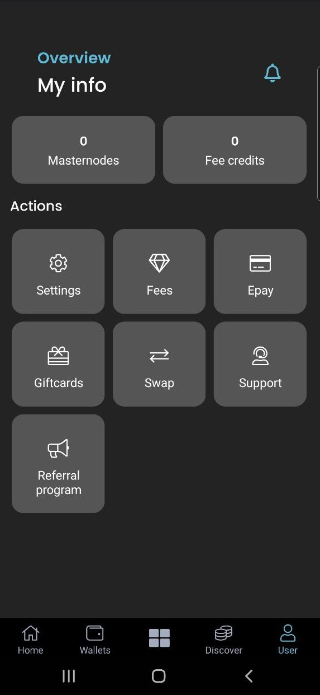

# ▪ How to Use the Flits Wallet App

### Balance, QR code, and Notification icons

* The topmost part of the Flits wallet window consists of the Balance, QR Code, and Notification icon:

<figure><figcaption></figcaption></figure>

1. **Balance**: Provides an overview of how much your assets are worth in your desired FIAT currency.
2. **QR code**: It acts as a convenient and fast way to grab the deposit addresses to your various wallets in addition to their respective QR code.&#x20;
3. **Notification**: It allows you to quickly access updates on your open support tickets

### Platform Statistics

<figure><figcaption></figcaption></figure>

* Provides an overview of the stats on the currently active users on the app, the total number of masternodes (MNs) deployed by users, and the total MN corresponding value in Bitcoin (BTC).
* Below these stats is the current Price of BTC which is updated frequently.

### My Projected Income

<figure><figcaption></figcaption></figure>

* This section of the wallet provides a breakdown of your earnings on a daily, weekly, Monthly, and yearly basis. It takes into consideration your various MN earnings and provides an estimate for the different timeframes.

### Navigation Buttons

<figure><figcaption></figcaption></figure>

1. **Home**: Used to navigate to the wallet's 'Home Page'
2. **Wallets**: Access your various wallets
3. **Quick Access option**: Save time by accessing some of the app's features right from the home page. Kindly note that the Flits Wallet App is now functioning as a wallet and a masternode deployment system only. This means features and services such as Gift cards, swaps, and mining will not work even though they are visible in the app.

<figure><figcaption></figcaption></figure>

4. **Discover**: It provides an overview of all coins and tokens supported in the Flits Wallet, their current price, and the type of services (e.g. Masternode, Gift card, etc) available for each coin.

<figure><figcaption></figcaption></figure>

4. **User**: Allows users to access additional information and features of the app. As mentioned earlier, the Epay and referral program will also be discontinued.

<figure><figcaption></figcaption></figure>

* **My info**: View the total number of masternodes you have deployed in the app and your remaining fee credit.
* **Actions**: Allows you to perform specific actions such as top-up your fee credit, contact support, access settings, etc.
