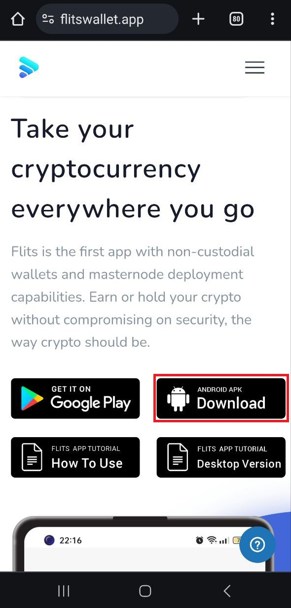
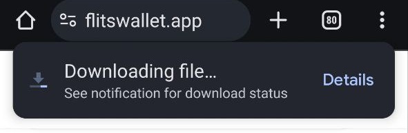
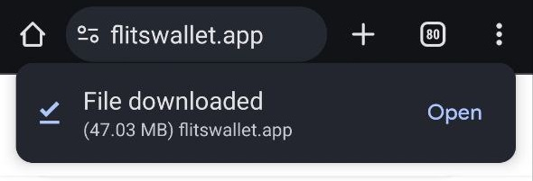
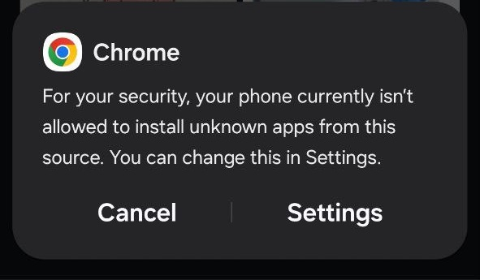
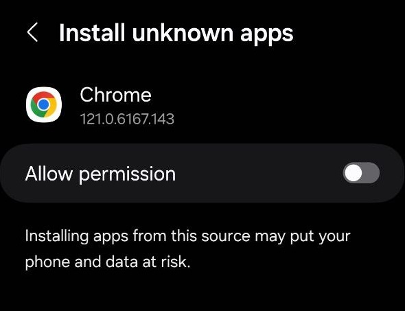
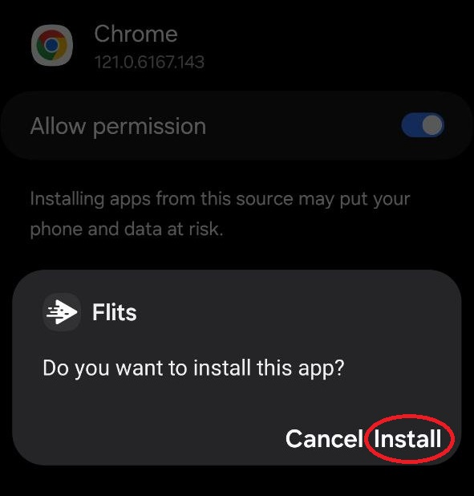
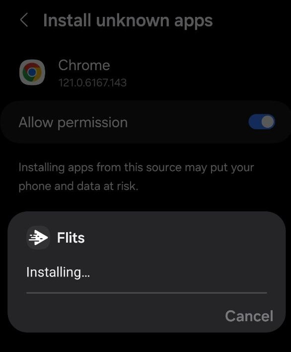
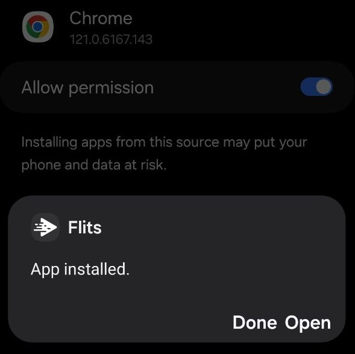

# ▪️ Installing Flits Wallet App APK File on Android

### Step 1

* Open [https://flitswallet.app/](https://flitswallet.app/). To download the Android APK, simply navigate to the homepage and locate the '**ANDROID APK Download**' button as shown in the image below:

<figure><figcaption></figcaption></figure>

* Upon clicking the 'ANDROID APK Download' button, the file will start downloading.

<figure><figcaption></figcaption></figure>

### Step 2

* After the download is finished, you can initiate the installation process by clicking on the 'Open' option.

<figure><figcaption></figcaption></figure>

### Step 3

* If this is your first time installing an APK file, you will need to grant permission to install apps from unknown sources.
* Click on 'Settings'

<figure><figcaption></figcaption></figure>

### Step 4

* Toggle the switch next to "Allow permission" to enable it

<figure><figcaption></figcaption></figure>

### Step 5

* Once you have granted permission to install apps from unknown sources, you will receive a pop-up asking if you want to install the Flits Wallet App.
* At this point, you can proceed with the installation by clicking on the "Install" button on the pop-up

<figure><figcaption></figcaption></figure>

* This will initiate the installation process of the Flits Wallet App on your device.

<figure><figcaption></figcaption></figure>

### Step 6

* After the installation is complete, you will have the option to either select "Done" to open the app later or "Open" to launch the app immediately.

<figure><figcaption></figcaption></figure>
