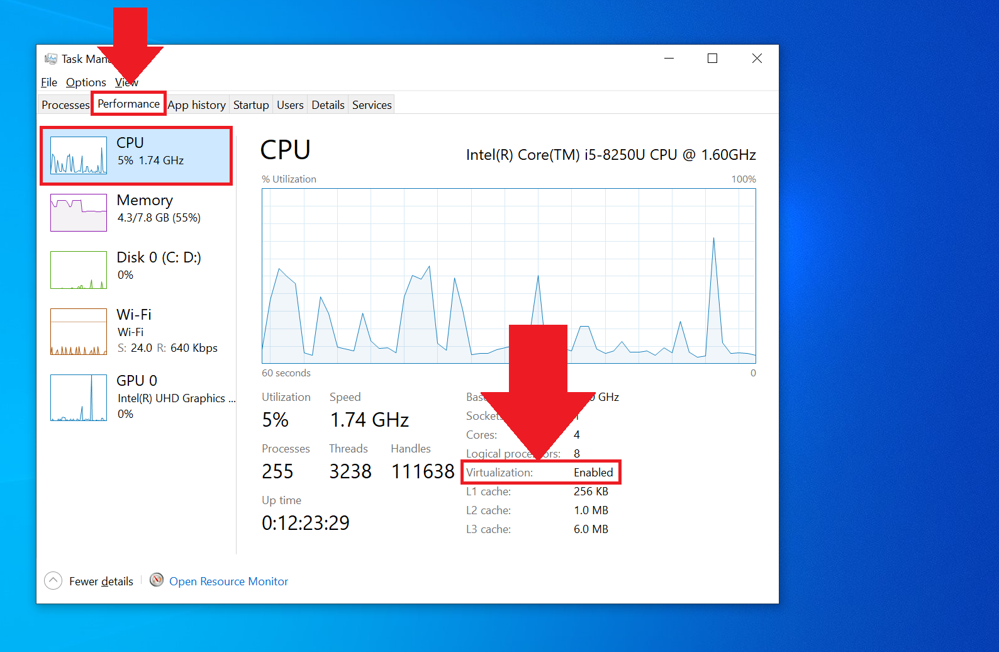

# ▪ Running Flits Wallet App on Windows and MacOS - Bluestacks

### Step 1

* To begin, we will need to download and save the Flit Wallet App APK file from [https://flitswallet.app/](https://flitswallet.app/) onto our PC&#x20;

<figure><figcaption></figcaption></figure>

### Step 2

* Next, we also need to download and install the BlueStacks version 4 [https://www.bluestacks.com/download.html](https://www.bluestacks.com/download.html)
* For macOS users, you will proceed to download the appropriate version for your computer.
* However,  Windows users must check if Virtualization is enabled on their Windows computer. This will determine the specific version 4 they need to download.&#x20;
* We do this by opening **Task Manager** using `ctrl + alt + delete` keys. Switch to '**Performance**' and under **CPU**, you will find the status as indicated in the image below:

<figure><figcaption></figcaption></figure>

* If Virtualization is enabled, you may download the '**Nougat 64-bit'** version. Otherwise, you can turn it on if your PC supports virtualization. [<mark style="color:blue;">**How to Enable Virtualization on Windows**</mark> ](https://support.bluestacks.com/hc/articles/360058102252?locale=en-us)
* On the other hand, you will need to download and install the '**Nougat 32-bit'** version if your PC does not support virtualization.

<figure><figcaption></figcaption></figure>

### Step 3

* Open BlueStacks after installing. You then be asked to sign into your Google account. Skip this step by clicking the '**I'll do it later'** button

<figure><figcaption></figcaption></figure>

### Step 4

* While on the homepage, select the '**APK icon**' on the far right of the screen. This will open a pop-up for you to choose an APK file to install.

<figure><figcaption></figcaption></figure>

### Step 5

* Select and open the Flits Wallet App APK file we downloaded in step 1

<figure><figcaption></figcaption></figure>

### Step 6

* After you click on open, the installation process will start. You will receive an alert in the form of a sound from your PC indicating the installation was successful.

### Step 7

* Switch to the '**My games'** tab and select Flits to launch the app

<figure><figcaption></figcaption></figure>

* After a few seconds, the Flits Wallet App will open for you to start exploring

<figure><figcaption></figcaption></figure>

Once you finally have the Flits Wallet App installed on your PC, you may either [<mark style="color:blue;">**recover an existing wallet**</mark>](how-to-recover-an-old-wallet-using-the-seed-phrase.md) or [<mark style="color:blue;">**create a new wallet**</mark>](getting-started-with-flits-wallet-app.md)
