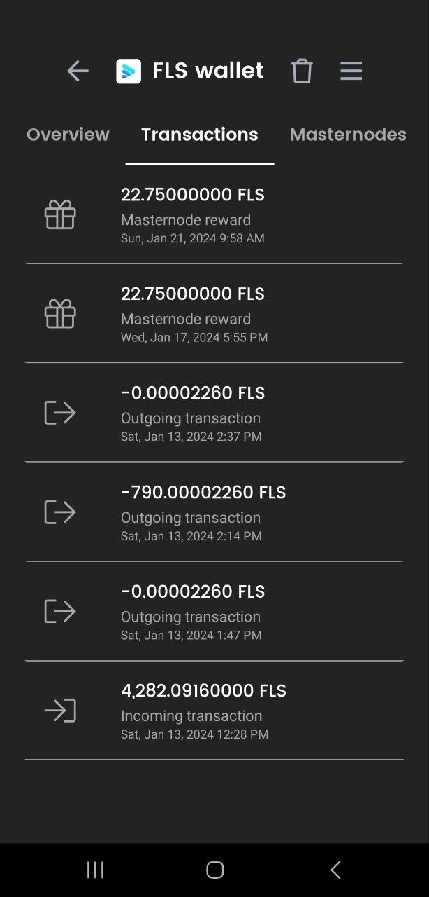

# ▪ Wallet Operations ( Send, Receive, Transaction history)

## Receiving coins

Receive coins from an external wallet using your dedicated wallet address

### Step 1

* From the specific coin's wallet overview (i.e. FLS wallet), select '**Receive**'

<figure><figcaption></figcaption></figure>

### Step 2

* Copy or share your wallet deposit address&#x20;

<figure><figcaption></figcaption></figure>

## Sending coins&#x20;

Send coins to yourself or external wallets

### Step 1

* While on the Wallet overview page, choose '**Send**'.&#x20;

<figure><figcaption></figcaption></figure>

### Step 2

* Enter the recipient's wallet address and amount as seen in the image below:
* Click on '**Send coins**' when done

<figure><figcaption></figcaption></figure>

### Step 3

* Confirm the transaction to initiate the transfer

<figure><figcaption></figcaption></figure>

### Step 4

* Get a confirmation indicating the transaction was successful

<figure><figcaption>
 
</figcaption></figure>

## Transactions history

* Switch to the 'T**ransactions**' tab to view all transactions related to a specific coin.

<figure><figcaption></figcaption></figure>
