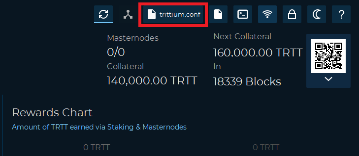
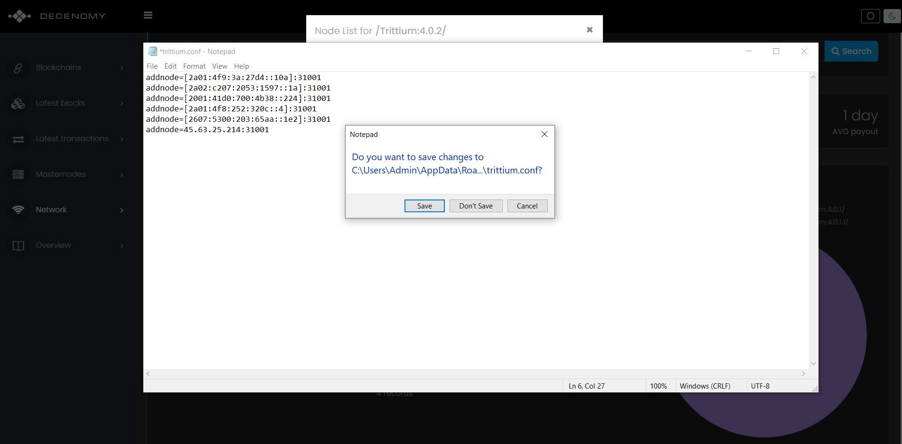

# How to add addnodes



In case we have problems connecting our wallet to the blockchain we need addnodes \(peers\).

Here we explain in a few simple steps how to do it.

First of all, let's open our wallet \(in our case Trittium\)

Now we go to the top right and we will see the configuration file icon \(in our case trittium.conf\).

As in the following picture

Now click on the configuration file icon to open it.

In case Windows asks us which program we want to use to open it, it is advisable to choose Notepad.

As in the following image

Now we type in the search bar the coin we are looking for \(in this case Trittium\).

Then we click on the name of the chosen coin.

As we can see in the next screen, we can choose the Network label from the left menu.

Now we choose the list of nodes that correspond to the version of the most updated wallet in this case 4.0.2

**The version of our wallet can be seen at the bottom left of the main screen of our wallet.**

Now we click on 4.0.2, this window will open and we copy the addnodes.

Now let's go back to the Notepad to paste the addnodes.

Now we can close the Notepad and save the file.

As in the picture

Once this is done, we close and restart our wallet to apply the changes.  
Now our wallet is ready to be used!

