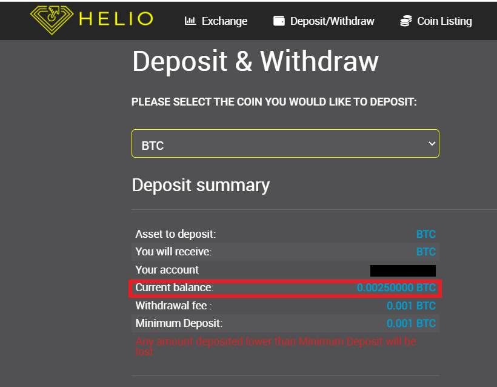

# How to buy Decenomy coins on Heliobank



In this guide we will explain how to buy Decenomy coins on Heliobank.

First of all we go to this link [https://dex.heliobank.net](https://dex.heliobank.net/) then we register.

We recommend that you do not lose your password, otherwise you will no longer be able to access your account. \(save the password in a safe place\).

After registration it will be necessary to verify our account with an identity document in order to make deposits and withdrawals \(usually accounts are verified in 48 hours\).

In the menu at the top right we choose the link verification.

In the next screen you will be able to upload the required documents.

When our account is verified we will be able to make a deposit, in this case in Bitcoin.

So now we click on Deposit / Withdraw

Once this is done we will find ourselves on the deposits page

Now let's choose.

* BTC from the drop-down menu
* Choose Deposit
* Copy the address

We can now send our Bitcoins to the newly copied deposit address.

After about a few minutes we will have our Bitcoins on Heliobank, as we can see from our Current balance.

Now we have to go on

* Exchange
* Show Markets

Once this is done, a search bar will open where we can choose the coins.

In this case we have chosen to buy Trittium \(TRTT\).

Now click on the TRTT market name to enter it.

A page will open with the buy and sell orders \(in this case Trittium\)  

Now we can proceed with the purchase.

We have 0.00250000 BTC available.

So we can buy Trittium for this value in the SELL orders table.

Now we need to click on the rows of the SELL table until the total of our order is equal to or greater than our Bitcoin balance.

In our case the third row of orders in the table gives us a total higher than our Bitcoins

available.

As in the picture

So you have to click on the available balance to buy as many Trittium as the Bitcoins available to us.

As in the picture

* Click on the Balance
* Click on BUY

Now a window will open confirming the operation. Then click CONFIRM.

Once the purchase is complete, we return to the Deposit / withdraw page.

And we choose Trittium \(TRTT\) from the dropdown menu.

.

Done this

* Click on WITHDRAWAL
* Click on WITHDRAW NOW

As we can see at the bottom left is our Current balance.

Now let's open our Trittium wallet

* Click on Receive
* Copy the address

Once the address has been copied, we return to Heliobank.

* Click on AVAILABLE \(to withdraw the full amount available\)
* Paste the address previously copied from our Trittium wallet
* Click WITHDRAW

We confirm and wait for the withdrawal request to be processed.

Now in our wallet we will see the transaction received, on the main screen.

