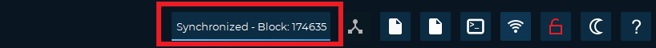

# How to synchronize the wallet with a bootstrap



In case there are any synchronization problems with your wallet, it is useful to know how to use a bootstrap (i.e. an archive containing the blockchain files).\
It is highly recommended to backup your wallet.dat file before making these operations.\
If you don't know how please refer to our guide **“How to make a backup on a USB stick”**\
****Done this, if your wallet is open you have to close it.

So now let's go to the site [https://explorer.decenomy.net](https://explorer.decenomy.net) as in the image:

.png>)

After that we choose in the bar at the top the coin that interests us (in our case Trittium), and we click on the link in the table below as in the image:

.png>)

Now a menu will open in the left bar:

* 1 choose the Overview item
* 2 click on the download button

.png>)

Once this is done we have to go to the taskbar (in this case of Windows).

Type in the search box %appdata% and press enter.

.png>)

After that a screen where there are many folders will open, and we will choose our folder (in this case Trittium) and click to open it.

See image:

.png>)

Now we need to delete some folders and files, as highlighted in the image:\
**it is important not to remove the "wallet.dat" file and the backups folder**

.png>)

Once this is done we will see the folder as in this image:

.png>)

Now we can go to the downloads folder to extract the files from the previously downloaded bootstrap.\
As in the picture:

.png>)

So let's copy the folders as in the image:

.png>)

Then we paste the files into the AppData \ Trittium folder (where we previously deleted the files and folders).

As in the picture:

.png>)

Now as we can see in the next image there are the folders that we have just extracted

.png>)

We can then restart the wallet (in this case Trittium) to check the status of the synchronization.

In the box at the top right you can see the status of the wallet synchronization.

