# How to use the DECENOMY wallets



In this guide we explain the main functions to use Decenomy wallets.

So let's open our Decenomy wallet (in this case the Trittium).

.png>)

Now we are going to explain the following functions step by step

1. Home
2. Send
3. Receive
4. Contacts
5. Masternodes
6. Settings

.png>)

**Home**

In the Home section we can see

* Total (the total of the coins owned)
* Available (the total amount of coins that can be spent)
* Locked (the total number of coins locked in the Masternodes)
* Immature (the coins that do not yet have enough confirmations to generate staking)
* Pending (coins received in unconfirmed transactions)

.png>)

Also in the Home we can see more information

* All (you can see all transactions)
* Received
* Sent (transactions sent)
* Mined (coin mined or generated through mining)
* Minted (coin generated by staking)
* MN reward (coin generated by the masternode)
* To yourself (transactions sent to ourselves)

Through this filter we can only view the transactions that interest us.

.png>)

In this other dropdown there is the following information

* Date desc (from the most recent to the oldest transaction)
* Date asc (oldest to newest)
* Amount desc (from largest to smallest transaction)
* Amount asc (from smallest to largest)

.png>)

In the right section of the wallet Home we can see the following functions

* Synchronized Block (shows us the status of the wallet synchronization)

.png>)

* Staking active (shows the active status of staking)
* Staking disabled (staking is disabled)

.png>)

* trittium.conf (used to open the wallet configuration file)

.png>)

* masternode.conf (used to open the masternode configuration file)

.png>)

* Debug Console (to give commands to the wallet manually)

.png>)

* Active connection(s) (the active connections in our wallet)

.png>)

* Unlocked Wallet (used to unlock the wallet for any operation)
* Lock Wallet (used to lock the wallet)
* Staking Only (the wallet is unlocked only to allow staking)

.png>)

* Dark Theme (used to switch from dark to light theme)

.png>)

* FAQ (frequently asked questions about the wallet)

.png>)

* Masternode (you can see the number of masternodes owned)
* Next Collateral (value of the next collateral)
* Collateral (value of current collateral)
* In (in how many blocks will the collateral increase)

.png>)

In this section we find the statistics of both staking rewards and masternodes

.png>)

**Send**

In the Send section we can see.

* TRTT address or contact label (used to enter the address to which you want to send the coins)
* Amount (to enter the amount of coins to be sent)
* Address label (optional field, if the address is in our contact list the label will be displayed)

.png>)

* Customize Fee (this option is used to customize the fee with which we send our transaction.

.png>)

It is advisable to use this option only if you are an expert user.

.png>)

* Clear all (used to clear the fields seen previously)

.png>)

* Add recipient (used to add additional recipients)

.png>)

As we can see, a field has been added where you can enter both the address and the amount of coins for a second recipient of our TRTT.

On the right we find three dots where there is the possibility to add or remove this address from the contacts.

.png>)

* Send (used to send the coins)

.png>)

* Coin Control (used to select the inputs to spend and to block or unblock them)
* Change Address (to select a custom change address)
* Open URI (used to open a payment request from the web)

.png>)

Coin Control

* Amount (the sum of the coins of the selected inputs)
* Quantity (the number of inputs selected)
* Fee (the preview of the transaction fees)

By clicking on the checkbox you can select or deselect the inputs that will be spent to send our funds.

Pressing OK confirms the changes made.

.png>)

Change Address

This is used to customize the address for receiving the unspent coins from a transaction sent.

.png>)

Open URI

It is used to open a payment request from the web.

.png>)

Reset to default (is used to cancel all changes made)

.png>)

**Receive**

* QR (the QR code associated with our TRTT receiving address)
* Add Label (used to assign a label to a generated address)
* Generate Address (used to generate a new address)
* Copy (to copy the address)

.png>)

* Create Request (used to generate a QR to request a payment)
* My Addresses (list of our addresses)

.png>)

Create Request

* Amount (insert the coins we want to request)
* Label (label to be associated with our payment request)
* Description (optional comment)
* Generate (used to generate the QR code)

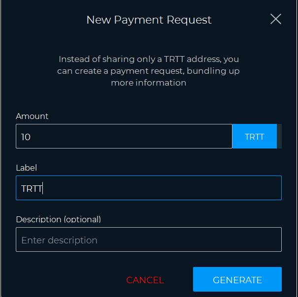

My Addresses

* by Label (order by label)
* by Address (order by address)
* by Date (order by date)

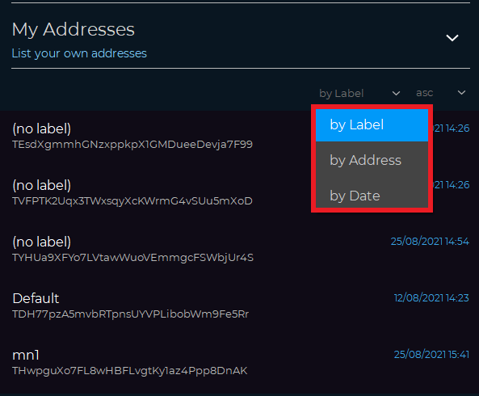

**Contacts**

* Add new contact

You can add a contact and save it

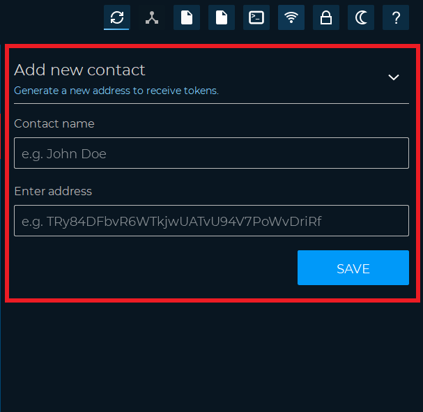

**Masternodes**

In the masternodes section we can check the status of our masternodes and access some functions for their control.

* Info (used to see the information of your masternode)
* Start (to start the masternode)
* Delete (to delete the masternode)
* Create Masternode Controller (used to access a guided configuration of your masternode)
* Start All (to start all masternodes)
* Start Inactive (to start only inactive masternodes)

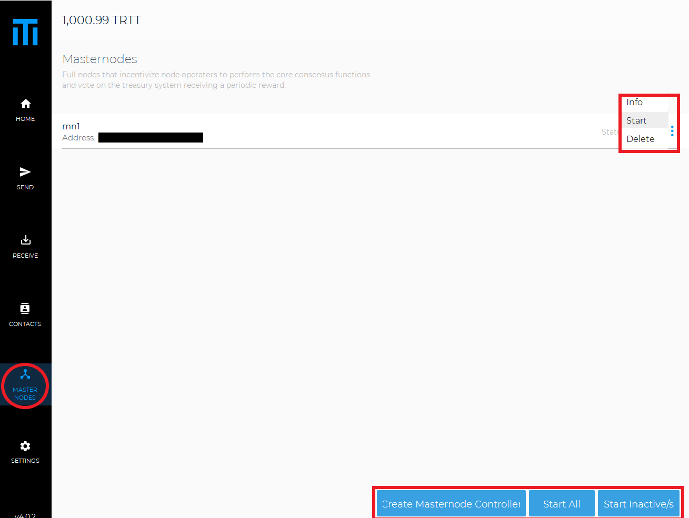

Here are some of the masternode states

ENABLED Your masternode has been enabled and is running on the network

ACTIVE Your masternode has been activated and is running on the network

NEW\_START\_REQUIRED Your masternode needs to be restarted. Go to your local wallet and start your masternode

EXPIRED Your masternode is not on the network. Simply restart the alias and wait 15 minutes. If that doesn't work, set up your masternode from scratch using a new transaction ID

REMOVE Your masternode is down and removed from the network. Simply restart the alias and wait 15 minutes. If that doesn't work, set up your masternode from scratch using a new transaction ID

**Settings**

* Wallet Data (access wallet features)
* Tools (access some utilities)
* Options (generic wallet settings)
* Debug (access console and repair options)
* Help (frequently asked questions)

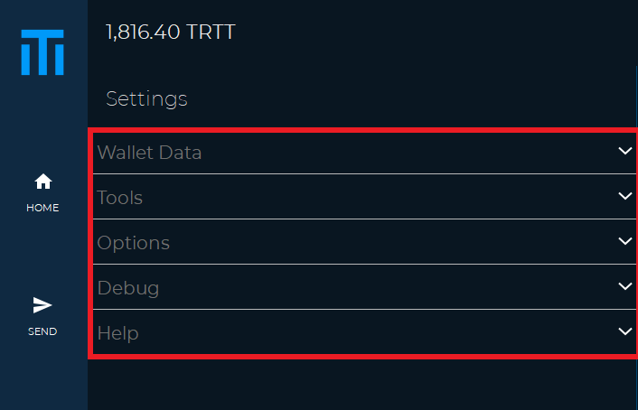

Wallet Data

* Wallet (from this section you can backup your wallet or change your password if encrypted)

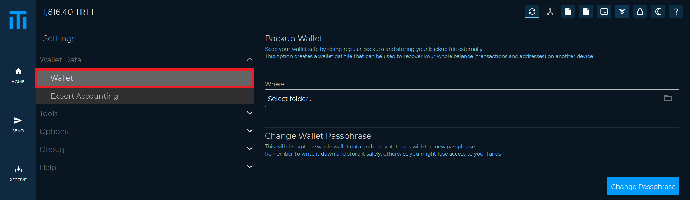

Export Accounting (you can export the history of transactions or your contacts in Excel format)

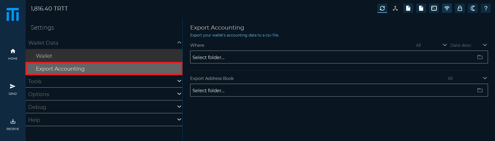

Tools

* Sign / Verify Message (from this section it is possible to sign a message to prove that you are the owner of an address, or to verify a signed message)

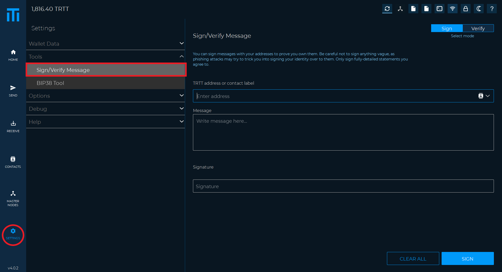

* BIP38 Tool (in this section it is possible to encrypt or decrypt a private key address pair)

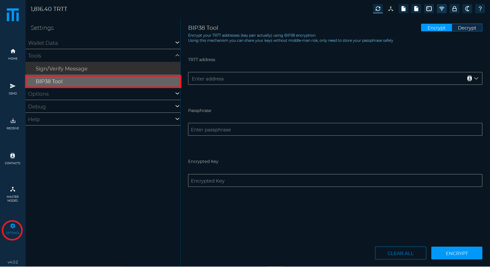

Options

* Main (generic wallet options, for example, such as automatic start when the PC is turned on

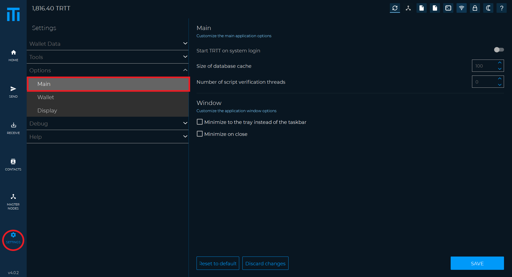

* Wallet (from here you can change some connectivity options or staking settings)

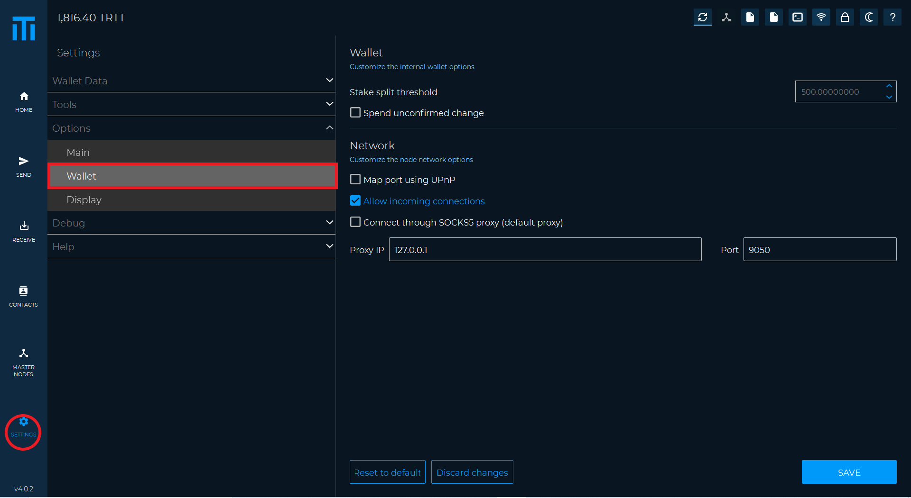

* Display (you can change the language, the amount of decimal units visible, or hide the staking graph)

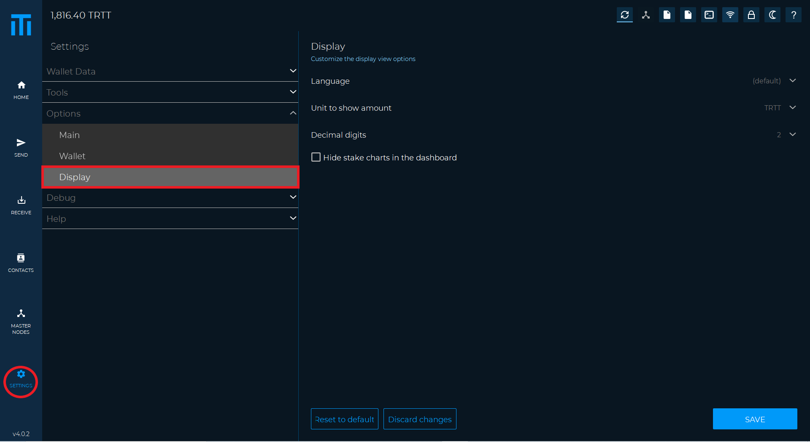

Debug

* Information (wallet information such as synchronization status, number of connections and wallet version)

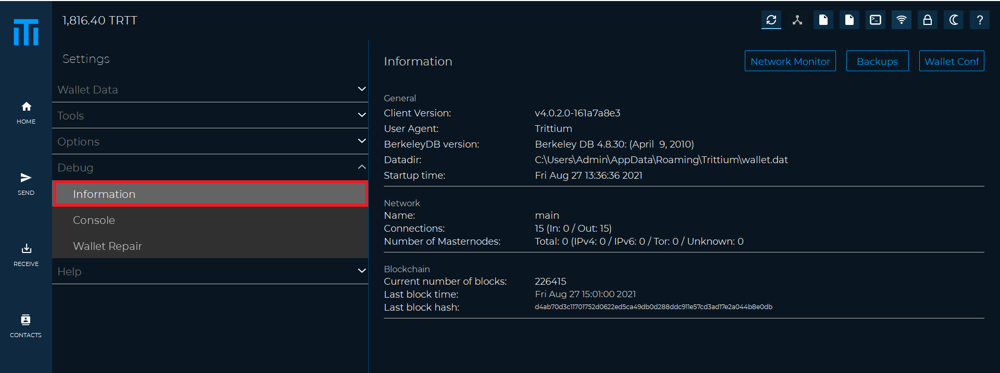

* Console (used to access various wallet control commands)
* Console input (here you can type the desired command)

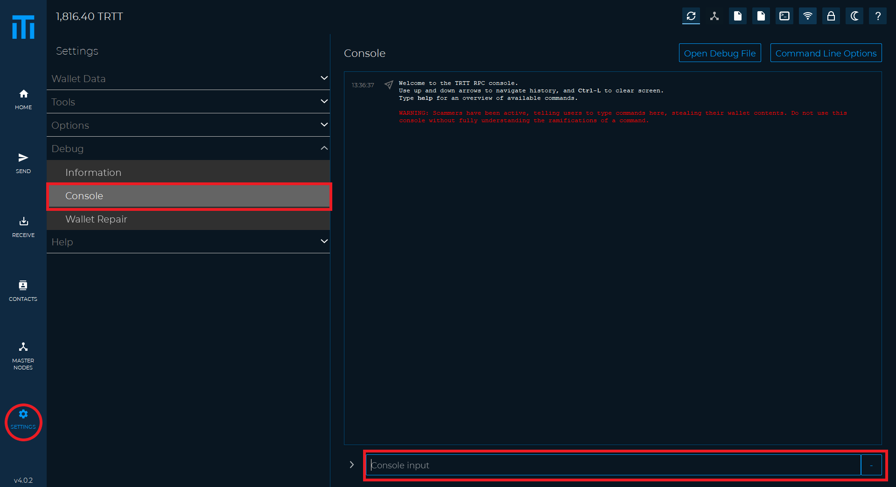

Below we list some of the most frequent commands

* help (command that shows us the list of all available commands)
* getinfo (show wallet information such as version, protocol, blocks and connections)
* listtransactions (show a list of the most recent transactions)
* addnode (to add new peers)
* createmasternodekey (to generate a new masternode key)
* getmasternodeoutputs (to see the list of eligible transactions to start a masternode)
* setstakesplitthreshold (used to divide your coins to optimize staking)

Wallet Repair

* Salvage wallet (try to recover private keys from a corrupt wallet)
* Rescan blockchain file (search for missing transactions in the entire blockchain)
* Recover transactions 1 (recover transactions from the blockchain while keeping the metadata)
* Recover transactions 2 (recover transactions from the blockchain without keeping the metadata)
* Upgrade wallet format (updates the wallet.dat to the latest format)
* Rebuild index (rebuilds the blockchain indexes)
* Delete local blockchain (deletes all local blockchain files to synchronize the wallet from scratch)

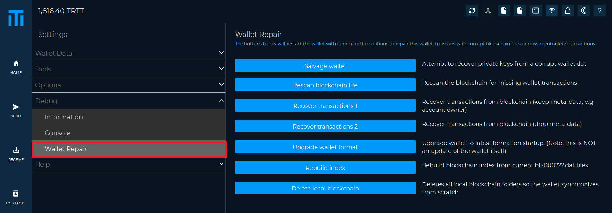

All DECENOMY coins use the same base code (DECENOMY standard wallet).

So this guide is valid for all DECENOMY coins!
