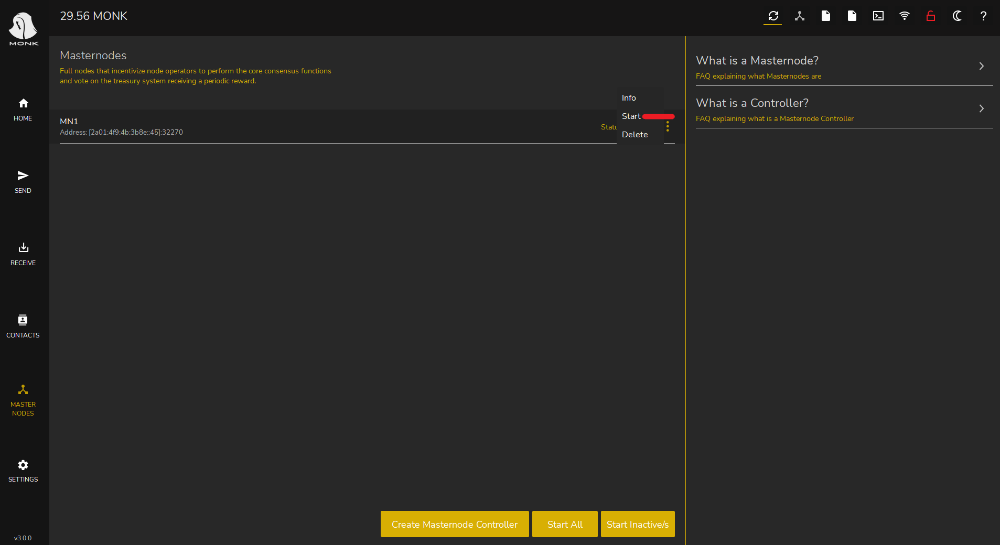

# How to create a masternode on IhostMN.com



This guide assumes you have an [ihostmn.com](https://ihostmn.com/) account and the coins needed to start a masternode in your local wallet.\
As soon as you log into ihostmn.com you will find yourself on the dashboard.\

 (1) (1).png>)

You will need to deposit a small amount via Paypal or cryptocurrency, to pay the monthly fees of your masternode (necessary to pay the hosting service offered by ihostmn.com) . Click on "Fund account" in the left menu to proceed.

 (1) (1).png>)

Once the payment has been made, the funds will be immediately available on your account. We can now click in the left menu on the “Masternode hosting” link. You will see all the coins available on the website, in our case we have chosen to run a MONK masternode. You can search MONK or any other coin using the search bar on the top.

 (1).png>)\
 (1).png>)

Then click on the name of our coin, in this case MONK, to proceed to the next screen.

As we can see, the name of the masternode, the transaction id (or collateral transaction) and the transaction index are required. Now we can move to our local wallet, where we have the 4000 coins necessary to create a masternode. (Do not close ihostmn website).

 (1).png>)

MONK requires 4000 coins to run a masternode (this value could change over time and it can be different for our other coins). Make sure to have a little bit more than 4000 coins to cover the transaction fee cost.

.png>)

To create a masternode we need to send exactly 4000 MONK to ourselves, to do that we need to click on “Receive” in the left menu, to generate a new address, and give it a name (for example MN1).

 (1) (1).png>)

Click on the “Generate a new address” button, then click on “Edit Label” to assign a name to this address, preferably without blank spaces. In our case it will be “MN1”. After that, we copy the address using the Copy button, we need it to send the coins to ourselves.

 (1).png>)

Once done we need to create the so-called “collateral transaction”. Click on “Send” in the left menu.

 (1).png>)

You will see three fields, in the MONK address field paste the address we just copied in the step before, in the amount field write exactly 4000. You will see the MN1 label filled automatically.

 (1) (1).png>)

We now click on the “Send” button to send the collateral transaction. We need some minutes for the transaction to be confirmed and reach the required confirmation to be eligible as masternode collateral (15 confirmations or about 15 minutes).

.png>)

We can now move to the debug console of our wallet to get the information requested by ihostmn.com. Click in the Settings menu (1), Debug (2), Console (3).

 (1).png>)

In the bottom bar type “getmasternodeoutputs” and press enter. If we did no mistakes, the command will generate an output like the following:

&#x20;{

&#x20;"txhash": "a6489efe528020ae21d6d693444bd0d2ee4555014ba4c709097008c7b59cbac6",

&#x20;"outputidx": 1

&#x20;}

 (1).png>)

We now have all the information we need on ihostmn.com!\

* Go back to the website
* In the masternode name field we will use MN1 (our masternode label)
* In the “transaction id field we will use the “txhash” (the long string of numbers and letters)
* In the “transaction index” field we will use 1 - the “outputidx” from the command above
* Now click on the “Deploy” green button

 (1) (1).png>)

You will see a Success message and you will be redirected to your dashboard. In your dashboard click on the MN Name link (MN1).

 (1) (1).png>)

Here is the place where you can see the details of your masternode, and some other actions. What we need is the masternode.conf configuration line. Click on the “Copy masternode.conf text file to clipboard” button to copy it.

 (1).png>)

We can now go back to our local wallet again. In the top right menu, click on the sheet icon (the fourth from the left) to open the masternode.conf file.

 (1) (1).png>)

Move to the last line and paste the configuration line we just copied from the website. Make sure that the configuration string is in one line! (Do not break it in two or more lines).

Save and close the text editor.

 (1).png>)

Now close and restart your wallet.Once restarted click on the “Masternodes” button in the left menu. We can now see our MN1.

.png>)

Click on the three small dots on the right and press “Start” and press Ok to confirm. Your node status will change to “ACTIVE” or “ENABLED”.

\
 (1).png>)

Depending on different factors, your node will start to generate rewards after some hours or days. Our masternode configuration is completed.

Enjoy your earnings!
