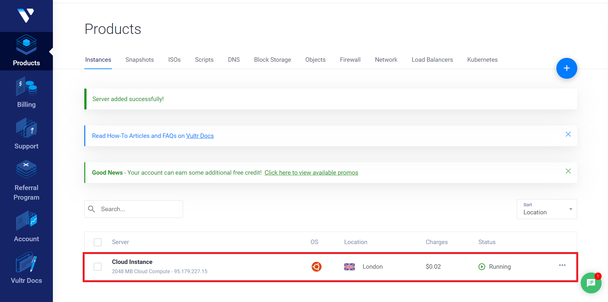
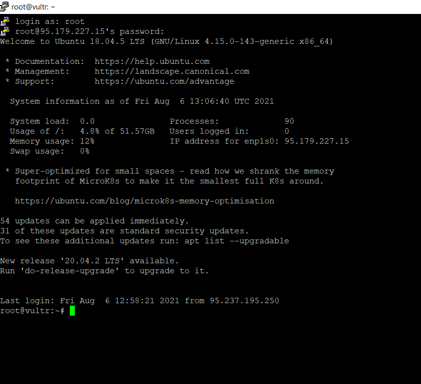

# ▪ Masternode deploy on VPS

\
NB each masternode needs a unique IP address, it is not possible to install 2 or more masternodes of the same coin on the same server.

If you want to make more masternodes of the same coin, you need different servers or IPV6 support.

To open a masternode with a VPS we must first install Putty if we use Windows.

So now let's go to the browser and type [www.putty.org](http://www.putty.org/)

(We will need Putty to connect to our VPS).

We are now on this page, so click on the link.

As in the following image

.png>)

Once this is done we will find ourselves on the download page, and then we choose the download for our operating system (in this case Windows 64-bit x86) and proceed with the installation.

.png>)

Now that we have Putty on our PC, we need a virtual private server (VPS).

To get our VPS we need to purchase it from a hosting provider.

For our guide we chose Vultr.

So let's go to our browser and type [www.vultr.com](http://www.vultr.com/)

let's register, connect our credit card or Paypal and we will find ourselves in the control panel.

Now let's choose Cloud Compute.

As in the picture

.png>)

After that, we choose the server location (it is better to choose it near where we are located) in this case we chose London.

.png>)

So we choose Server Type

* 64 bit OS
* Ubuntu
* 18.04 x64

.png>)

Once this is done, let's choose Server Size (which are the technical specifications of our VPS).

In our case we chose the 10 dollar one.

And click on Deploy Now.

As in the picture

.png>)

We wait for the server installation to complete.

We click on our new server.

As in the picture

Now we will find ourselves on the Server Information page

At the bottom left we find our credentials.

* IP Address
* Username
* Password

.png>)

We recommend that you save all the necessary data on Notepad because they will be used in the following steps.

.png>)

Now let's go to open our wallet (in this case Monk).

.png>)

Now that we are in our wallet, let's take these simple steps that are necessary to create the so-called collateral transaction.

* We click on receive
* We generate a new address
* We modify its label (we have chosen MN1 and remember how we labeled it for later use)
* We copy the address

.png>)

A Monk masternode currently requires 4000 Monk, which we need to send to ourselves, so:

* Click on Send in the left menu
* Paste the previously copied address
* We insert in the amount the exact amount for our masternode (in our case 4000)
* We click send

We just created the collateral transaction!

.png>)

Once we have sent the coins to ourselves, we wait for 15 confirmations (about 15 minutes).

In the image we can see the transaction labeled MN1, payment to yourself.

.png>)

Now let's go to the Debug console

* We click settings
* Debug
* Console

In the debug console we have to type the following commands in the bar below

* &#x20;getmasternodeoutputs
* &#x20;createmasternodekey

The first command gives us the details regarding our collateral transaction.

The second generates a masternode key.

.png>)

Then we copy the result of the following commands.

(We save this information in a Notepad file).

.png>)

Now we can open Putty (which we had previously downloaded).

And let's open the Notepad where we saved the server credentials.

* We enter the IP address in the Host Name.
* We click on open.

.png>)

If this is the first time we connect to the server, click on accept.

As in the pictured

.png>)

Now Putty will ask us for the username and password, let's go to the Notepad where we have saved the credentials and insert them.

* login as: root (press enter)
* root@95.179.227.15's password: we put the password

(while we type nothing will appear do not worry it is normal and we press Enter).

We are now on our server (let's leave it open).

Let's go to decenomy GitHub, at this link [https://github.com/decenomy/MONK](https://github.com/decenomy/MONK) to download the script to install the masternode (in our case Monk).

We click in the contrib folder.

.png>)

Now we click on masternodesetup

.png>)

Scrolling down the page we find these commands to insert on Putty.

After copying the first command on GitHub, let's go back to Putty and paste it and hit enter.

Now we do the same operation with the second command and hit enter.

The installation of the masternode will then start.

After a short time we will be prompted for the masternode key that we generated earlier (and as I advised you we saved it in Notepad).

Let's copy and paste it on Putty and press enter.

.png>)

If everything went well we will see this message.

Remember that the port in this case is 32270 (we will need it in a later step).

You can see it at the top right in the next image.

.png>)

While waiting for the wallet on the VPS to complete the synchronization, we can finish the configuration in our local wallet.

In our wallet, go to the top right in the masternode.conf icon and click on it.

As in the picture

.png>)

The masternodes configuration file will open in which we must enter the necessary data that will be used to start the masternode.

We must enter the following data:

* Name of the masternode (we had chosen MN1).
* IP address and Server port (the IP address 95.179.227.15 that

&#x20;we find on the Notepad that we had previously saved for Vultr and

&#x20;the port in this case is 32270 as we have seen before).

* Masternode key 2oFd9sWqkDF8Um4LW3y3ys5gRLkUnkCHFUZkNtDG5uXsuZmqxyY

&#x20;(we can find it in the Notepad where we saved it in precedence).

* Transaction hash 6edc186b904fd34045812ce75e42b342194a45a204b8da27a452cab9bf2fd367

&#x20;(the long string of letters and numbers we saved earlier in the Notepad)

* Output index 0

\
In the image there is a legend showing the last three steps.

.png>)

Now all the above data must be inserted in the masternode.conf file

Taking care to separate them with a space and without a new line

NB The IP and port must be separated by a colon.

We save the file, close the wallet and start it again.

Now let's go to the left menu and click on masternodes.

Then we start our masternode by clicking on the three dots on the right and then on start.

As in the pictured

.png>)

We now have our masternode!
