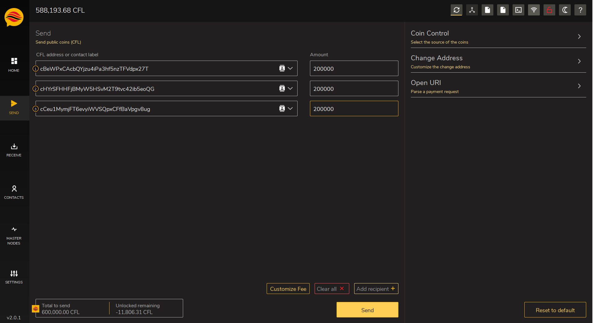

# 🔸 How to run multiple MNs on the same VPS



In this guide we explain how to configure multiple masternodes of the same coin in a single server, using IPv6.

We buy a VPS on [Vultr.com](https://vultr.com/)

Click on deploy new server

.png>)

We choose

* Cloud Compute
* A location near us

.png>)

We choose

* Ubuntu 18 or 20
* Server size (we chose the $ 20 server)

.png>)

So let's make sure we add IPv6 and then deploy the server.

.png>)

We can then move to the settings-> IPv6 menu to see our configuration.

.png>)

With Putty let's connect to our server using the credentials provided in the overview section.

Let's move to the **/etc/netplan** folder and edit the **10-ens3.yaml** configuration file

With the following commands

* cd / etc / netplan
* nano 10-ens3.yaml

We add all the IPv6 addresses that we want to activate in the range provided by our hosting provider.

In this case we have access, in addition to the primary IPv6 address assigned to us, to the entire dynamic 64bit range of our primary IP (the last four groups of four digits).

For convenience we will start at 0000:0000:0000:0000 and increment the last digit by one number.

(We are using Vultr as an example, but that should work in a similar way with any other VPS/dedicated server provider, from Ubuntu 17.04 or above).

As shown in the picture

.png>)

We press ctrl + x, y, enter to exit and save the changes.

Then we type the **netplan apply** command to activate the new configuration.

Once this is done we can start sending the collateral transactions to configure the three new masternodes (in our case CFL).

In the wallet we generate three addresses and assign a label to them.

.png>)

Now we can send the three collaterals, we can do that in a single transaction.

Now we can verify the transaction id and index, and generate three masternode keys.

We use the following commands

* getmasternodeoutputs
* createmasternodekey

.png>)

Now we can start configuring the masternode.conf file just adding our server IP addresses.

Now download the linux wallet on our server and copy it to have three different instances.

We use the following set of commands in the home directory, in our case /root

* wget https://github.com/CryptoFlowCoin/CryptoFlowCoin/releases/download/v2.0.1.0/CryptoFlow-2.0.1.0-Linux.zip
* mkdir cfl1 cfl2 cfl3
* unzip CryptoFlow-2.0.1.0-Linux.zip
* cp cryptoflowd cryptoflow-cli cfl1/
* cp cryptoflowd cryptoflow-cli cfl12
* cp cryptoflowd cryptoflow-cli cfl13
* rm CryptoFlow-2.0.1.0-Linux.zip cryptoflow\*

Before starting the wallets, we manually create the data directories and related configuration files.

* mkdir .cryptoflow .cryptoflow2 .cryptoflow3

For each data directory we create a cryptoflow.conf configuration file

Example

* nano \~/.cryptoflow/cryptoflow.conf
* nano \~/.cryptoflow2/cryptoflow.conf
* nano \~/.cryptoflow3/cryptoflow.conf

Here we can enter the configuration parameters and save the file.

Below we show two examples

The first refers to the IPv4 configuration, the second refers to the IPv6 configuration.

rpcuser=cfl3

rpcpassword=cflmn3

rpcport=13336

rpcallowip=127.0.0.1

port=13333

listen=1

server=1

daemon=1

maxconnections=64

bind=70.34.203.123

masternode=1

masternodeaddr=70.34.203.123:13333

masternodeprivkey=4SVSgqELM1C5NmgxRcn7EXMYzhSWxZZMsxKAUyG5ptS8UB5Tj3R

\-------------------------

rpcuser=cfl1

rpcpassword=cflmn1

rpcport=13334

rpcallowip=::1

port=13333

listen=1

server=1

daemon=1

maxconnections=64

bind=\[2a05:f480:2000:160c:0000:0000:0000:0000]

masternode=1

masternodeaddr=\[2a05:f480:2000:160c:0000:0000:0000:0000]:13333

masternodeprivkey=4RdXDLVmhaNLwgrY46NG8RWHeeVfTLkLiX4WWR3mNTXe8XM6d7Y

\-------------------------

Now we can start our wallets taking care to specify the path of the data directory when it is different from the default one.

It is also suggested to start the IPv6 wallets first and then the IPv4 one.

* \~/cfl1/cryptoflowd
* \~/cfl1/cryptoflowd -datadir=/root/.cryptoflow2 -conf=/root/.cryptoflow2/cryptoflow.conf
* \~/cfl1/cryptoflowd -datadir=/root/.cryptoflow3 -conf=/root/.cryptoflow3/cryptoflow.conf

We now wait for the wallets to be fully synchronized.

Once the synchronization is complete we can restart our local wallet to apply the changes made previously to the masternode.conf file and then start the mastrenodes from the debug console using **startmasternode** command, as in the picture.

.png>)
