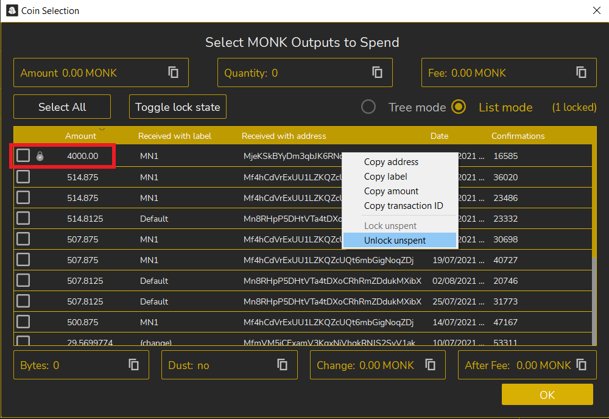
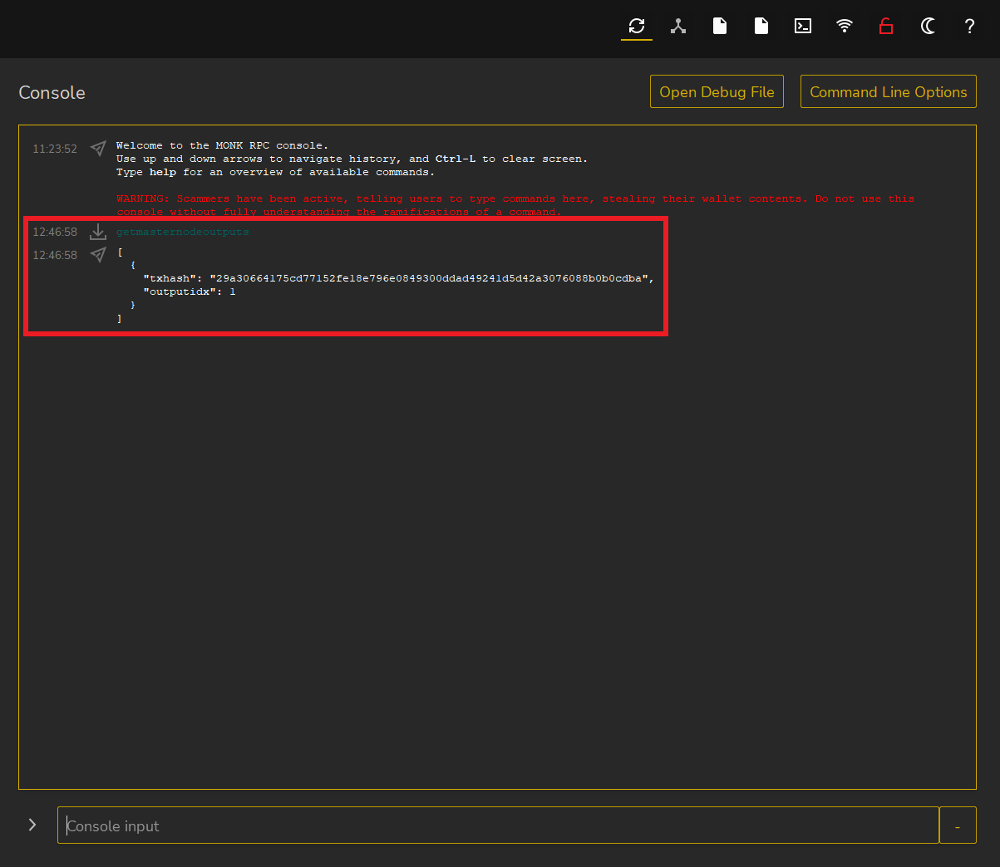

# 🔸 How to update a masternode collateral



Let's open our wallet (in this case Monk)

The collateral has increased from 4000 to 8000 Monk and as we can see from the masternodes menu our masternode is missing.

.png>)

Now we need to unlock the old collateral (the previously blocked 4000 coins transaction).

To do this we go to

* Send
* Coin Control

.png>)

Now a window will open, as we can see in the image the masternode transaction is labeled with a padlock icon.

We have to right click on it and choose Unlock unspent to unlock it.

Now we need to send a new 8000 Monk transaction to ourselves.

So

* Click on Receive
* Generate a new address
* Modify the label (we use the name of the old masternode again in our case MN1)
* Let's copy the address

.png>)

Now let's go to the menu

* Click send
* Paste the address
* Insert exactly 8000 in the amount
* Click send

Now we click send to confirm the sending of the funds.

.png>)

Now let's go back to the home screen and we can see that the payment to ourselves is confirmed after 6 confirmations (about 6 minutes).

.png>)

Now let's go to the Debug Console and click on it.

.png>)

The debug console will open where we have to enter the command below

* getmasternodeoutputs

Press enter to get the following information

* hash of the transaction
* outputidx

Let's go to msternode.conf and click on it.

.png>)

The Notepad will then open in which we need to replace

* hash of the transaction
* outputidx

.png>)

From the console we copy

* hash of the transaction
* outputidx

Let's replace them in the Notepad.

We save and restart the wallet.

.png>)

From the home screen

* Click on masternodes
* Click on the three dots and choose start

.png>)

Now that the collateral is up to date, our node is ready!
