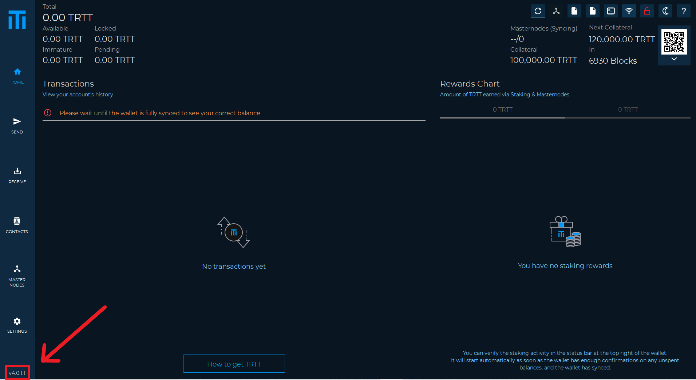

# 🔸 How to update a wallet



In this guide we will explain how to update a wallet:

First we open the wallet (in this case Trittium) so we can verify the wallet version at the bottom left.

We can check for updates through our official channels (Discord, website, or directly on GitHub).

After we have verified that there is an update to be done (in some cases the updates are mandatory otherwise the wallet will stop working) we have to download the latest version, in the case of Trittium we can find it on GitHub at the following address:

[https://github.com/Trittium/trittium](https://github.com/Trittium/trittium)

The GitHub address should be copied and pasted into the address bar as in the image below:

.png>)

Entering the GitHub site you will have this screen:\
Then click on the right on the RELEASES link.

.png>)

And this screen will appear:

.png>)

As we can see the latest version is V4.0.1.2, which is different from our wallet (ours was V4.0.1.1)

Now we choose the correct version for our operating system (in our case Windows) then the one for Windows will be TRTT-4.0.1.2-Windows.zip

.png>)

Once the file has been downloaded, we can go back to our wallet to close it.

Once this is done, go to the download folder and extract the zip

which contains the new version of the wallet as in the image below:

.png>)

Once the file has been extracted we can copy "trittium-qt" and paste it (in this case in the desktop) to replace the previous version, in the next images you will see how:

.png>)

.png>)

\
Now we can start our wallet which will be updated and ready to be used.
