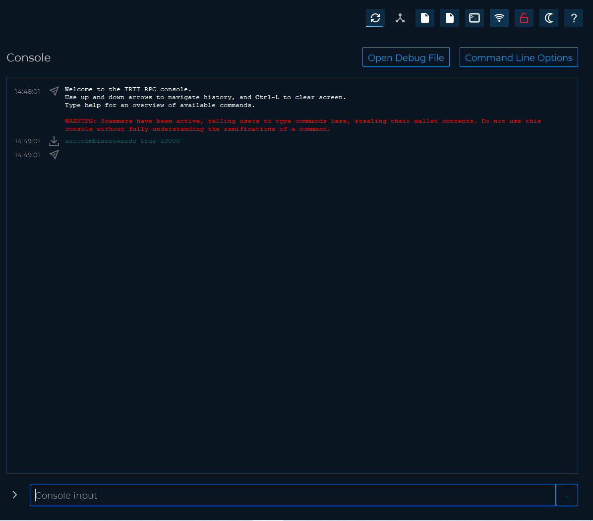

# Staking optimization and common problems



This guide explains how to optimize staking and solve the most common problems.

We open our wallet (in our case TRTT),and let's make sure staking is active.

.png>)

**Staking optimization**

When staking, the larger the address balance the more will be earned.

However, when we receive a reward, the coins are spent and it is necessary to wait for 600 confirmations to be available again for staking (mature)

it is therefore useful to divide the coins into different inputs through the **setstakesplitthreshold** command.

Whenever a successful stake is found, the stake amount is split across as many outputs (each with a value

higher than the threshold) as possible.

E.g. If the coinstake input + the block stake reward is 2000, and the split threshold is 499, the corresponding

coinstake transaction will have 4 outputs (of 500 TRTT each).

It is also possible to set the split value from the UI, Settings→Options→Wallet

.png>)

**Example**

_setstakesplitthreshold value_

Where _value_ is the number of TRTT we want the inputs to split into.

Let’s open the debug console and let's try to set the value to 500 TRTT coin the following command.

_setstakesplitthreshold 500_

.png>)

Another useful command to know is **autocombinerewards**

Periodically the wallet will look for 'dust' in your addresses, and combine them up to the number of coins set in the configuration setting. _autocombinerewards true value_ will enable a feature that will automatically combine all staking / masternode rewards you receive in to one input, up to the amount that you specify with value.

So, if you want your minimum input size to be 10000 TRTT, then you would want to run the command in your debug console as follows: _autocombinerewards true 10000_.

Then any inputs less than 10000 will be swept into a new input, repetitively until the combine threshold is exceeded.

Once that threshold is exceeded, the grouping begins with another input. Your wallet MUST be unlocked when a reward is received for this to take effect.

Let’s open the debug console and let’s try to run the command.

If the command does not generate any error message everything went well.

**Common problems**

We can check the staking status in detail with the following command

_getstakingstatus_

.png>)

Below is an explanation of the result of the command.

* "staking\_status": true|false, (boolean) whether the wallet is staking or not
* "staking\_enabled": true|false, (boolean) whether staking is enabled/disabled in trittium.conf
* "haveconnections": true|false, (boolean) whether network connections are present
* "mnsync": true|false, (boolean) whether masternode data is synced
* "walletunlocked": true|false, (boolean) whether the wallet is unlocked
* "stakeablecoins": n, (numeric) number of stakeable UTXOs
* "stakingbalance": d, (numeric) TRTT value of the stakeable coins (minus reserve balance, if any)
* "stakesplitthreshold": d, (numeric) value of the current threshold for stake split
* "lastattempt\_age": n, (numeric) seconds since last stake attempt
* "lastattempt\_depth": n, (numeric) depth of the block on top of which the last stake attempt was made
* "lastattempt\_hash": xxx, (hex string) hash of the block on top of which the last stake attempt was made
* "lastattempt\_coins": n, (numeric) number of stakeable coins available during last stake attempt
* "lastattempt\_tries": n, (numeric) number of stakeable coins checked during last stake attempt

For staking to be active, the first six values must necessarily be "true".

Below we explain how to solve the most frequent problems

* haveconnections : if false, you don't have connections to the coin network. Make sure you have internet access, consider port being blocked or bad connectivity.
* walletunlocked : if false, click the lock icon in top right,select staking only and enter your passphrase.
* mnsync :if false, wait 20 minutes. If still false, consider to delete mncache.dat and mnpayments.dat files from the data directory.
* staking status :if all of the above is True and this is still False, first try, close the wallet for 30 seconds, open and unlock (if encrypted), wait 5 minutes.

That’s everything you need to know about staking.
